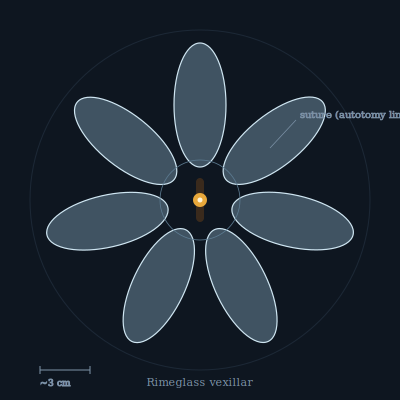

## Anatomy

A heated chitinous spine the length of a finger, ringed by six to nine radiating vanes of **biogenic ice** the vexillar secretes and anneals itself. Each vane is a plano-convex lens-plate, grown optically smooth; the creature spends idle hours regrounding pits with a wax it sweats from its mantle. The spine's anterior holds a small metabolically warm core (an amber nub visible through the ice), the only soft tissue. There are no eyes — light is sensed directly by the photosynthetic mantle lining each vane's root.

## Behavior

It tacks across the upper atmosphere on thermal gradients, angling vanes to catch faint Rime-light for photosynthesis. When grasped, a vexillar **shatters one vane at its suture** and drops away on the recoil; the lost plate regrows over weeks. Reproduction is fragmentation: a vane deliberately detaches at maturity, drifts on the high winds, and if it settles on favorable crystalline ice, germinates a new core from the mantle cells frozen into its base. Most fail. The few that strike root become a new spine within a season.

## Myth

Drift navigators read vexillar fragmentation-events as omens of thinning air ahead — a vane falling past a landmass means the Rime above is stressed and the passage is closing.
