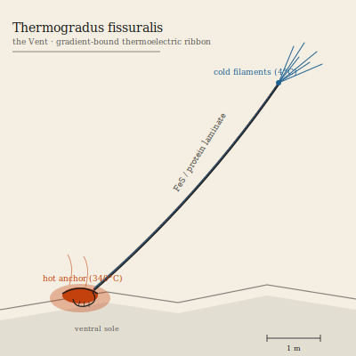

## Anatomy

A flat ribbon two to four meters long, five centimeters wide, anchored at its two ends to substrate of wildly different temperature — one buried in 340°C vent brine, the other trailing into 4°C ambient seawater. The ribbon is a laminate of alternating iron-sulfide and conductive-protein layers, grown one atomic deposition at a time by the organism's own vent-facing edge: a living Seebeck junction, tens of thousands of them in series. There is no gut, no mouth, no heart. The entire energy budget is the voltage generated across the gradient, bussed along a nerve-like metal-sulfide busbar to a ventral creeping sole that rasps chimney sulfides for the raw material to extend the ribbon's length. The cold end terminates in a frayed brush of filaments serving as the organism's only sense — a thermal map of ambient water, read as current.

## Behavior

It is bound to its gradient the way a lung is bound to air: lift both ends into the same temperature and circulation — both electrical and circulatory — halts within seconds, killing it. A Thermogradus migrates only when its hot anchor cools or its cold end warms, and then only by the riskiest possible motion: it releases the cold filaments first, drifts them through ambient water to a cooler perch, and only then inches the hot anchor forward — a sequence that, if interrupted, equalizes the ribbon. Reproduction is longitudinal fission along the laminate's midline; the two daughter ribbons share the original anchors for a season before one detaches to drift, cold-end-first, until it snags a new thermal boundary. Most drifters die equalized; the few that anchor seed fissures kilometers apart.

## Myth

Vent-forge folk will not touch a living Thermogradus, claiming the ribbon is a "thought the fissure is having about heat." Their heat-engines are built as deliberate mockeries of its body, and every smithy's first lesson is that a thermocouple killed cold-end-first dies screaming — a lesson no Thermogradus has ever been observed to confirm.
