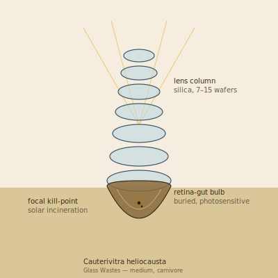

## Anatomy

A slender vertical column of biogenic silica thirty to eighty centimeters tall, grown as a stacked Petzval series of seven to fifteen meniscus lenses — each lens a separately-secreted wafer of near-pure optical glass, indexed by a living protein film that also repairs abrasion from windblown grit. Below the sand the column broadens into a buried bulb lined on its inner wall with a dense photoreceptive retina, the only nervous tissue the creature possesses; the retina and the gut are the same organ, a light-chamber that both sees and digests. There is no mouth. The column is the eye, the bulb is the stomach, and the focal point where they meet is the kill site.

## Behavior

Cauterivitra orients its column to track the sun and simultaneously projects a real, inverted image of the surrounding waste onto its retinal wall — it perceives the world only as a dim picture inside its own buried body. When motile prey crosses the focal cone, the lowest meniscus lens concentrates sunlight onto it with a precision of a few millimeters, igniting chitin and desiccating tissue in seconds; the charred remains drop through the focal aperture into the bulb and are dissolved over hours by a photic acid activated only in direct sun. Between kills it sits inert, indistinguishable from the glass spars around it, and nomads have watched a column wait motionless for a full season before a single tilt ended a passing hopper. Reproduction is by thermal fracture: under extreme heat-shock a lens-plane shears, and any fragment still bearing retina-tissue re-roots downwind, regrowing its own column from a single lens bud over years, the new optical prescription never matching the parent's.

## Myth

Glass Waste travelers read standing Cauterivitra as sundials and steer wide of the bright streak on the sand where its focal cone lands — a column tilted toward you, they say, is the desert learning to spell your name in light. To carry a shed lens is said to give dreams seen from inside a closed eye: whole horizons burning inverted on the back of your skull.
