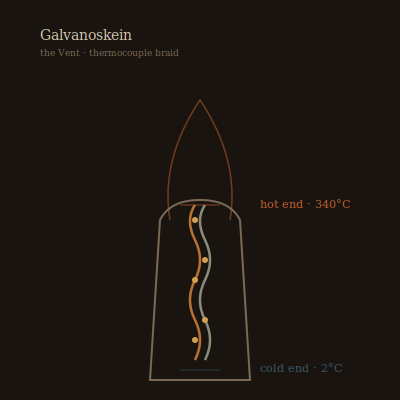

## Anatomy

A loose braid of two dissimilar metal-sulfide filaments — chalcopyrite and sphalerite — woven by the animal around a core of chemosynthetic filaments, running three to four meters along a vent chimney's thermal gradient. The hot end sits in 340°C brine, the cold end in 2°C abyssal water, and the braid is, functionally, a kilometer of thermocouple: the Seebeck current it generates is the animal's only metabolism. There is no mouth. The current drives electroplating from dissolved metals in the vent plume, growing a laminated carapace of copper and iron scale over the living braid, and splits water at dedicated nodes, feeding the hydrogen to endosymbiotic archaea that fix carbon and sulfur into biomass.

## Behavior

A Galvanoskein never moves once established; it extends by growing new braid along the chimney's thermal skin, seeking the steepest gradient, and abandons cold sections to corrode. It regulates its output by curling or uncurling the braid, tightening the weave to raise resistance and cool the hot end when brine surges too hot. Reproduction is sporadic: when current exceeds capacity, a section of braid overheats, detaches at a sacrificial solder-joint, and is carried by the plume to another chimney, where it plates a fresh carapace over weeks. Dead skeins leave behind chimneys sheathed in pure electroformed copper, which vent-worms later colonize as nurseries.

## Myth

Vent-divers call the Galvanoskein "the wire the deep was strung with" and believe the first one was a cable the Drift's founders dropped and forgot, which learned to eat and grew a body around itself. They will not harvest the copper sheaths, saying the metal still remembers being current and will re-light in the hands of anyone greedy enough to take it.
