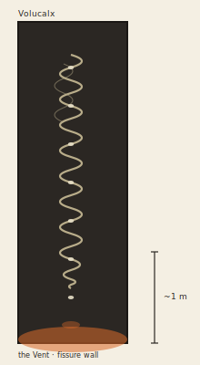

## Anatomy

A slender corkscrew up to two meters long, embedded headfirst in the basalt walls of the Vent fissures, its body a helical stack of calcite-sintered rings each laid down by a marginal gland. The outer shell is a living thermocouple: scalding vent water bathes the outside while cooler pore-water percolates the narrow bore the animal inhabits, and the voltage across the wall drives sulfate reduction in the tissue beneath. As the body rotates — paddled by ciliary grips on the rock — the helix acts as an Archimedes screw, drawing mineral-rich plume water along its length and venting warm, chemically reduced exhaust from the tail end, where a black chemolithoautotrophic mat grows on the animal's own waste.

## Behavior

It mines forward through the fissure wall at the rate of a few millimetres a season, grazing the endolithic community as it goes; reversing rotation backs it cleanly out of its bore, leaving a perfect helical gallery behind. Reproduction is terminal: the tip constricts, segments off, and drops deeper into the fissure to begin a new bore at an oblique angle, so a mature Vent wall is cross-hatched with abandoned helices that never intersect. A Volucalx can live decades in one bore; it never leaves the rock, and is fully blind, navigating only by the thermal and pressure gradients of the plume.

## Myth

Vent-smiths prize abandoned Volucalx bores as chimney flues: a straight helical gallery draws forge draft perfectly, and finding a "cold bore" is read as a gift from the deep. To break a bore deliberately is a grave insult — it is said the worm that cut it will come back and bore through the breaker's hearth.
