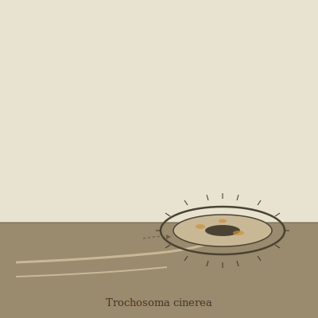

## Anatomy

Trochosoma is a gelatinous cartilaginous torus, 15–20 cm across with a central aperture the width of a fist, ash-grey and translucent enough that the amber gut contents churn visibly inside the ring wall. There is no head, no mouth, no eyes; the outer equator carries forty-odd bands of compound cilia that drive the body like a tank tread, and a ring of statocysts just beneath the skin keeps "down" oriented to the axis of rotation so the creature never tumbles. The inner wall of the hole is glandular, secreting a continually renewed mucous net; as the torus rolls across the Mire's surface film, detritus-laden water is drawn through the aperture, filtered, and expelled behind as a cleared wake.

## Behavior

It grazes in long slow furrows across the muck at dawn, when the night's rain of dead aeroplankton has settled on the surface film, leaving behind a pale cleaned trail that other Mire-scavengers re-colonize within hours. Every few minutes it halts, sloughs the loaded mucous net into a bolus, and peristalses the bolus around the ring wall to a digestive sinus where it is dissolved; a fresh net is secreted in seconds. When startled it does not flee: it ties itself, rolling its own body through its aperture to form a dense figure-eight knot and sinks into the anaerobic layer, where the low oxygen and high sulfide make it unprofitable to anything that would eat it. It reproduces by transverse fission — a single torus constricts, pinches into two linked rings, and they roll apart over a morning.

## Myth

Mire-folk carry dried Trochosoma knots as worry-stones, turning them when a problem seems intractable; the saying goes "the wheel that ties itself forgets the road," meaning some knots are solved only by becoming unmovable. Diviners read the cleaned furrows at first light as a record of what the upper Drift has dropped overnight.
