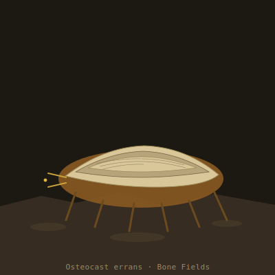

## Anatomy

A low, six-legged animal the size of a calf, built around a skeleton it did not grow but inherited. The Osteocast bores into calcified fossil deposits with a pair of acid-secreting mandibles, dissolves the apatite matrix, and digests the residual organics preserved in the Drift's mineral-sealed dead. The freed calcium phosphate it does not excrete — it re-precipitates it, epitaxially, onto its own outer carapace, templating new armor plate directly off the crystal lattice of whatever it last ate. An individual's shell is therefore a stratified palimpsest: bands of marine invertebrate, terrestrial grazer, older things unnamed, laid down in the order they were consumed. Beneath the armor the body itself is soft, amber, and grublike; only the borrowed skeleton is hard.

## Behavior

It roves a fossil deposit for years, grinding a slow pit into the badlands, then abandons the exhausted bone and walks — stiffly, the gait of every leg dictated by whichever fossil plate currently covers its joints — to the next outcrop. In famine it resorbs its own outermost armor plates for the trapped organics, shrinking and shedding segments until it is little more than a jaw on legs; given a fresh deposit it rebuilds within weeks, the new plate conforming to whatever the stratum yields. Mating is by shed-plate exchange: two Osteocasts rub flanks until a thin outer plate flakes free and each adheres the other's plate to its own shell, so offspring inherit a starter skeleton seeded from both parents' dietary history.

## Myth

Bone-field pilgrims claim you can read a dying Osteocast's shell like a chronicle of the Drift's dead, the oldest plates at the center holding creatures that no longer exist anywhere but in the calcium the beast chose to keep. Some necromantic orders carry a polished Osteocast plate as a relic, swearing the inherited lattice still dreams the shape of whatever it once was.
