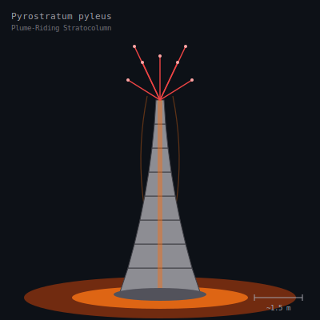

## Anatomy

A telescoping column of hollow mineralized rings — iron monosulfide laminated with silica — grown by electroplating dissolved metals straight out of the hydrothermal brine. The crown is a spray of conductive whiskers that read the electromagnetic turbulence of the convecting plume; there is no mouth, no gut. Metabolism is a living thermocouple: 350°C vent fluid pulses through the lumen, ambient seawater bathes the outer wall, and the redox gradient across the ring wall is the only energy source the animal has ever needed.

## Behavior

It anchors its basal disc in the throat of a vent fissure and extends or retracts ring-by-ring to hold itself inside the narrow thermal front where the gradient is steepest. Growth happens only at the leading (hot) edge, where metal ions plate out and the column lengthens; the cold basal end slowly starves and mineralizes to dead stone. When the dead base can no longer hold, the whole column pinches off and tumbles downstream in the brine current — the severed, still-living crown re-anchors elsewhere and regrows downward. That severed crown is the only offspring it will ever produce, and two stratocolumns will fight, whisker to whisker, over a prime orifice by shorting out each other's gradient.

## Myth

Drift-folk below the Canopy call them **the Fingers of the Deep God** and believe each column is a digit of something vast pressing up through the crust. A vent whose columns have gone silent and white is said to be a god falling asleep, and the cooling of that fissure is read as a prophecy of plague.
