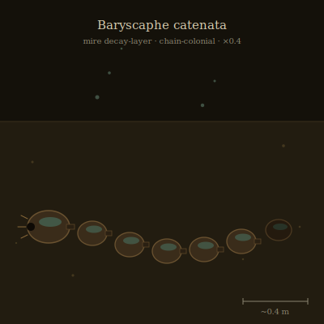

## Anatomy

A chain of eight to thirty chitinous capsules, each the size of a clenched fist, linked head-to-tail by muscular sphincters into a flexible train one to two meters long. Every capsule is divided internally into a methane-filled gas bladder above and a ciliated filtration gut below; symbiotic methanogenic archaea line the gut wall and gas the bladder from the decay the animal filters, so buoyancy is metabolically earned, not stored. The lead capsule is enlarged, blind, and studded with chemoreceptive papillae around a muscular pharynx; the rearmost capsule is sealed and dormant, a detachable dispersal bud. There is no central nervous system — a hollow nerve cord runs through every sphincter, and peristalsis is coordinated by pressure waves passed segment to segment.

## Behavior

Baryscaphe worms through the Mire's liquid decay layer by sequential compression: each capsule floods its gut, the sphincter behind it clamps, and the segment drives forward like a piston, passing the thrust down the chain. It descends by venting methane through dorsal pores and rises by sealing them, diving and surfacing through the muck on a slow tidal cycle tied to the archaea's gas production. The lead capsule seizes carrion and larger infauna with its pharynx; trailing capsules strain the disturbed slurry, so a single chain functions as both predator and filter at once. Chains contest muck corridors by ramming — two leads lock papillae and vent methane in mutual bursts until one chain fragments, the loser shedding segments that each re-seal and drift away as new chains. When a chain exceeds roughly thirty segments the rearmost bud detaches, rises to the surface film, and metamorphoses into a motile dispersal stage that crosses open muck to seed a new colony elsewhere.

## Myth

Mire-dredgers claim the depth of the decay is measured not in fathoms but in Baryscaphe — that wherever a chain can still rise, the muck is alive, and where chains no longer surface, the Mire has died below and will not be dredged again. A diver who surfaces with a sealed capsule still clamped to their line is said to carry a debt: the bud will hatch wherever it is set down, and whatever grows from it remembers the depth it came from.
