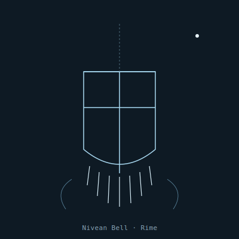

## Anatomy

A hollow hexagonal bell 20–30 cm tall, grown from a secreted antifreeze glycoprotein lattice onto which atmospheric moisture freezes in oriented columns. The organism itself is the protein film — a thin living sheath lining the bell's interior — while the ice is non-living scaffolding. At the bell's lip the protein draws out into tens of tuned icicle tines of graded lengths; wind across the open mouth sets them ringing at a chord no single tine could produce. No mouth, no gut: trapped prey dissolve in the meltwater pooled at the bell's base and are absorbed straight through the film.

## Behavior

It hangs motionless in the Rime's slow updrafts, ringing continuously. The chord is tuned to the resonant frequency of the common aether-plankton's gas-bladders, which rupture on contact and rain dissolved organics into the bell. It orients by tilting into the prevailing wind to maximize resonance; a bell in still air starves within days. When the Rime dries seasonally the ice sublimates and the protein film collapses into a desiccated cyst the size of a sand grain, drifting down to the Canopy to wait out the drought.

## Myth

Canopy-dwellers collect the fallen cysts and grind them to a powder said to preserve the voice of whoever last spoke into the wind before a Rime-storm; singers swallow a pinch before performing, believing it lends their notes the cold clarity of the upper air.
