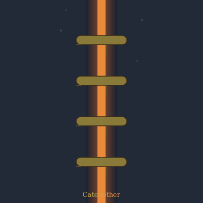

## Anatomy

A linear chain of six to fourteen hinged pods, each a rough pyrite-rimmed cylinder the size of a fist, strung across a geothermal fissure like a drawbridge no one built. Each pod bears two asymmetrical feet: a long hot-stilt that drops into the 340°C sulfur plume and a short cold-stilt gripping the fissure's chilled basalt lip. Between the feet runs a bismuth-iron filament lattice the pod precipitates from the plume itself; the 300-degree differential across the lattice drives a steady current — the organism's only energy source, no gut, no mouth.

## Behavior

A catenother never moves once set. A larva drifts plume-side until it bridges a crack, cements its cold-stilt, and lets the hot-stilt cook into place over hours. The current powers electroosmotic pumps that draw fresh metal-rich brine through the lattice, replenishing the filament as older layers corrode and flake off as a black ash that feeds the surrounding bacterial mats. Reproduction is by self-immolation: a mature chain grows a terminal pod hotter than its own lattice can bear, the filament fuses, and the overbuilt pod is launched by steam pressure into a neighboring fissure to seed.

## Myth

Vent-divers prize a shed cold-stilt as a "still-warm" charm against drowning, believing the creature's refusal to move is a vow made to the deep. A chain that has bridged the same fissure for a generation is called an oathkeeper, and is never harvested.
