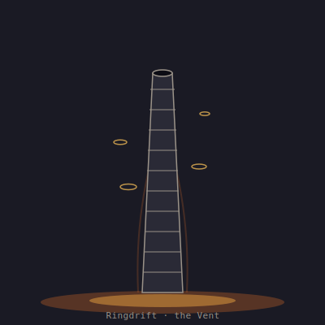

## Anatomy

Ringdrifts are hollow calcite columns, one to two meters tall, standing directly in vent effluent. Each column is a stack of several hundred ring-shaped zooids fused edge to edge, every ring a one-way valve that lets superheated water pass upward but not back. There is no mouth, gut, or nervous system; the inner wall is a permeable lattice hosting chemoautotrophic microbes that fix sulfur compounds as the plume flows through. A thin mantle of tissue seals the outer calcite, and the whole animal is essentially a biological thermosiphon, circulation driven by the vent's own heat gradient rather than any pump.

## Behavior

A ringdrift spends its adult life anchored in one fissure, growing new rings at the apex and shedding the oldest, lowest rings as they mineralize solid. Those shed rings do not die: they unseal, trap a bubble of vent gas, and rise on the plume to drift laterally in the deep currents until they settle on a new fissure and found a fresh column. Because each ring is a clone, a single ringdrift can seed dozens of vents across a thermal field over its lifespan. When a vent cools, the entire column disarticulates ring by ring and evacuates upward over the course of hours.

## Myth

Vent-dwellers call them "the chimneys that walk" and believe a ringdrift column marks a vent the Drift itself has chosen to keep; a vent whose ringdrifts have departed is said to be dying, and settlements built on such vents are abandoned within a season.
