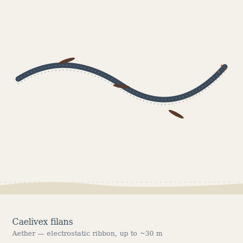

## Anatomy

A flat ribbon ten to thirty meters long and a handspan wide, built from millions of linked chitinous pressure-cells strung on a continuous muscular fascia. Each cell is a vacuum-pumped silken bladder rather than a gas-filled one — buoyancy in the thin Aether is useless, so Caelivex lifts instead by electrostatic repulsion: the ribbon's edges carry cilia that ionize passing air, and the body holds a net charge against the ionosphere overhead. The upper surface is laid with a dark, UV-absorbing pigment lattice that cracks atmospheric ozone into oxygen radicals, feeding an anaerobic energy pathway no other Drift animal employs. There is no head; both ends are identical and either can lead a tack.

## Behavior

Caelivex sails rather than flies. By alternately charging its leading and trailing edges it rides the potential gradient between Canopy below and Rime above, beating to windward across the open sky like a sailboat against a thermal. It feeds on the upward rain of spores, pollen, and small Aether migrants, which snare on its adhesive charged cilia and are routed by capillary action into a central digestive groove running the ribbon's length. Reproduction is by fragmentation: stress tears a segment free, and the segment regrows both ends into a complete new ribbon — so nearly every individual a pilot encounters is a clone of one ancient ribbon that broke apart centuries ago. Caelivex never voluntarily descends; it dies when its charge bladders leak below the lift threshold and it sinks into denser air, where it simply drowns.

## Myth

Aether-pilots read the ribbons as living compasses, since at dawn they align along the local field lines and a practiced eye can find any landmass by their angle. But every child of the drift is taught never to tether a fouled craft to one: sailors who did speak of the ribbon slowly reeling them upward toward the Rime, calm and unhurried, and none of those craft were ever seen again.
