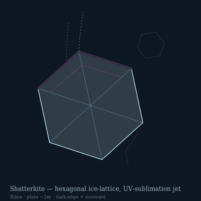

## Anatomy

A flat hexagonal plate two meters corner-to-corner and barely a millimeter thick, grown as a single doped-ice crystal laced with a living protein felt that controls deposition along the basal plane. The lattice is not pure water — trace ammonia and dissolved metalloproteins depress its melting point and give it a faint blue-violet iridescence, while a scattering of dark pigment cells along the leading edges absorbs ultraviolet. There is no gut, no nerve cord, no symmetry beyond the six-fold crystal one; the organism *is* its own skeleton, and the protein felt is its entire soft tissue.

## Behavior

Shatterkites drift in the high Rime on slow thermal currents, orienting their dark leading edges into the sun so absorbed UV sublimates a thin crescent of ice into a backward jet of water vapor — a whisper of thrust that lets them tack across wind instead of being blown helplessly. They feed by interception: charged dust and ionized atmospheric gas stick to the cold lattice face and are digested inward by the protein felt, the metals incorporated as new dopants, the rest exhaled as vapor. Reproduction is catastrophic and non-negotiable: when a plate grows large enough that wind shear loads its basal plane past the fracture limit, it shatters along crystal cleavage lines into six or more daughter plates, each carrying a wedge of living felt that immediately resumes growth — the parent does not survive, and the daughters never meet.

## Myth

Rime-watchers say a Shatterkite is the last breath of a world-tree that climbed too high and froze, exhaled as a single flat crystal to be carried wherever the light takes it. To hear one shatter overhead on a still night is said to be a death that has chosen someone far below, the falling daughter-plates the soul's fragments looking for a body to seed.
