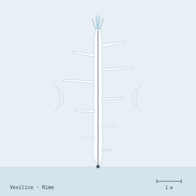

## Anatomy

A vexilice is a self-grown ice banner two to three meters long and a handspan wide, grown as a single dendritic crystal around a flexing spine of biogenic antifreeze protein. The lattice is perforated by thousands of micro-flues that tune the whole ribbon like an aeolian harp; wind passing through produces a sustained chord whose pitch shifts with the density and trajectory of any body upcurrent. From the leading edge retract capillary needles of nearly pure ice, sharpened to a few molecules across, fed by a ventral gland of concentrated antifreeze brine. It has no eyes, no gut — only the chord, and a wicking groove that runs the spine's length to a sump of symbiotic chitinolytic cells.

## Behavior

It rides the Rime's jet streams passive and edge-to-wind, listening to its own tone. When the chord detunes — prey displacing air upcurrent — it tacks by melting one ventral flank asymmetrically (metabolic warmth from the spine), tilting the banner to close. On contact it spears the prey and injects brine; the victim's own ice-lattice collapses into a slush the vexilice wicks capillary along its groove to the sump, where symbionts digest it over hours. Reproduction is by spall: jet shear snaps a meter-long distal fragment, which re-nucleates a fresh protein spine from symbiont cells frozen into the lattice and drifts off as a new individual. A vexilice that loses its chord — a cracked flue — stops eating and starves within days, deaf to its own body.

## Myth

Rime-crossers say the vexilice's chord is the voice of the dead frozen mid-fall, still humming as they descend. To hear your own name inside the tone is a death-omen, so travelers hum constantly on the high jets, drowning out recognition. A banner found silent and grounded is called a "spent voice" and is left untouched; elders say re-humming one reawakens whoever it was.
