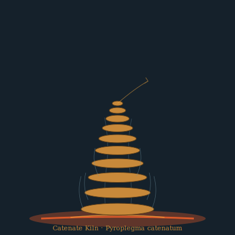

## Anatomy

A tapering column of mineralized discs, 30–80 cm tall, each disc a slightly different alloy — iron-sulfide, copper-sulfide, zinc-silicate — laid down by the organism itself. There is no mouth and no gut; the disc interfaces host thermoelectric junctions, so the whole stack functions as a slow heat-engine harvesting the vent's thermal gradient. The outer crust is colonized by filaments of chemosynthetic symbionts whose fixed carbon leaks inward, feeding the stack's metabolism.

## Behavior

It sits immobile for weeks at a time, then re-orients by a controlled topple: the stack tilts until it falls, re-deposits its discs facing the richer side of the gradient, and re-anchors. Encounters between two stacks are rare and brief — they braid their columns together for a few hours to exchange mineral "seeds," then separate. Each seed, dropped at a fresh fissure, germinates a new stack. Growth rings are visible in cross-section; the oldest documented stack has been dated to nine centuries.

## Myth

Vent-dwellers hold that the stacks are cooling pipes for a world-engine buried below the seafloor, and that a stack toppling toward you is an omen of vent death.
