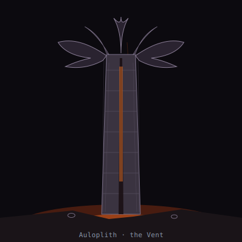

## Anatomy

Auloplith is a self-secreted mineral column, three to seven meters tall, hollow, built from layered barite and amorphous silica precipitated out of vent brine by its own mantle tissue. There is no heart: superheated fissure water rises through the bore by thermal convection, and the animal is, in effect, a living chimney — the gradient is the pump. The column wall is studded with a felt of chemosynthetic filaments that strip hydrogen sulfide and ferrous iron from the flow, fixing carbon into tissue faster than any phototroph in the dark reaches ever could. At the summit spreads a fanned crown of mineral-veined membranes, dark as iron, through which cooled brine drains back down the outside of the shaft in slow rivulets.

## Behavior

It roots over a fissure and stays put for decades, growing taller as the wall thickens and the bore narrows; if the fissure migrates, the column leans, topples, and rolls across the scoria until a new upwelling catches its open base and re-seats it — a slow, century-scale tumbling migration across the Vent floor. Reproduction is budding: the crown sheds dense, cysted "ingots," heavy as pebbles, that sink into the fissure rubble and germinate only where they meet water above 80°C. Most ingots never find heat and lie mineralized among the scoria for centuries, indistinguishable from the surrounding slag until a fresh fissure opens beneath them.

## Myth

Vent-delvers swear a toppled Auloplith will roll toward the hottest water it can find, and read the direction of fall as a dowsing rod for new fissures. They also refuse to smelt ingots recovered from dead ground — "cold iron still remembers the deep," they say, and a forge fed with one is said to weep brine from every weld.
