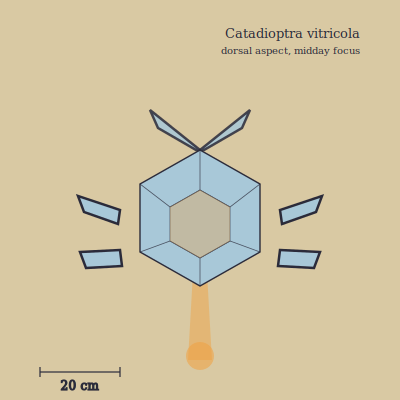

## Anatomy

A flat hexagonal carapace forty centimeters across, grown as a mosaic of several hundred calcite prisms the animal secretes and micro-rotates with ciliary muscles at each prism's base — a living lens array, not a shell. Six legs of the same calcite are hinged by bimetallic strips: the dark phototrophic underside expands faster than the vitreous dorsum when sunlight strikes, ratcheting each leg forward one notch per sun-fleck, so the animal walks on illumination the way a clock walks on a spring. There are no eyes; it perceives the world as a constellation of focal hotspots its own prisms project onto its dark belly, reading heat as shape. The mouth is a slit on the underside, ringed with the symbiotic glass-algae that supplement its diet.

## Behavior

Catadioptra moves only in direct sun and is rigidly inert from dusk to dawn, anchored by claws it cannot voluntarily retract. To hunt it tilts its carapace until three or four prisms share a focal point on the sand ahead — typically on a smaller lithotroph or a sun-stricken arthropod — and holds the beam until the prey's tissues rupture and caramelize; it then walks, one thermal step per pulse of light, to the scorch and feeds. When startled it reconfigures the prism array to project a refracted, life-sized image of itself several meters to one side, and most predators strike the mirage while the real animal takes its slow solar steps away. Mating is optical: two adults align carapaces until their prism arrays form a single shared focus, and the heat at that point fuses a larval prism-disc that both then walk away from.

## Myth

Wastes-crossers carry a sheet of smoked glass at noon, claiming a Catadioptra cannot focus on what it cannot see lit — but it can, and the smoked glass only spares the traveler from the blinding flash that precedes the killing beam. A circular scorch on a pack or cloak is called a "letter from the glass-saint," and is kept rather than patched: the superstition is that a second beam will not fall on the same mark.
