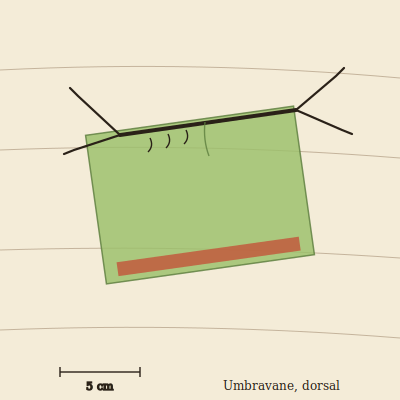

## Anatomy

A flat, hand-sized membrane animal shaped like a tilted rectangle, built around a single rigid chitin spine that runs one long edge and carries the gut, nerve cord, and a row of rasping mandibles beneath. Four splayed legs, jointed like a leaf-insect's, extend from the spine's corners and end in bark-gripping hooks. The membrane itself — the strange part — is not the animal's own tissue but a living sheet of world-tree photosynthetic bark, peeled as a larva from a host branch and kept alive ever since by a rootlet that taps the spine's own sap-vein. The vane wears the canopy on its back. The graft's underside is dark and absorptive; its upper surface is the same green bark it was cut from, still photosynthesizing, still technically tree.

## Behavior

An Umbravane farms by draping its graft over a fresh patch of sunlit bark, pinning the corners with its legs, and waiting several hours. The shade triggers the world-tree's stress response: the masked patch upregulates a red accessory pigment, sweeter and nitrogen-rich, to salvage what little light leaks through. The vane then lifts, flips its graft aside, and rasps the reddened layer free, leaving a paler scar that the tree re-greens over weeks. Each adult tends a circuit of thirty to fifty patches, never re-shading one inside a month, and defends its route fiercely against rivals — territorial disputes are slow shoving matches, graft pressed to graft, until one cracks a corner and retreats. Mating is an exchange: two adults trade corner-flaps of their grafts, each grafting the foreign bark onto their own back; a larva hatches beneath the new flap and peels its first membrane from the host branch it was born under.

## Myth

Canopy-walkers hold that the Umbravane is not a creature at all but a piece of the world-tree that learned to walk away and come back — a thought the canopy thinks in circuits, pruning itself by shaded inches. A vane found dead on the bark is left untouched; its graft is said to take root within a season, and the branch that grows from it is marked as a "borrowed limb," never to be harvested.
