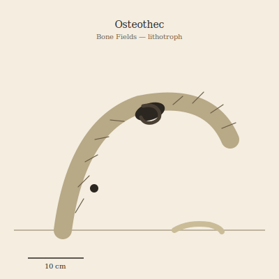

## Anatomy

A soft, eyeless vermiform body the length of a forearm, wrapped around a biogenic acid gland and a chitin-grinding radula. It lives almost entirely inside the marrow cavity of a fossilized bone, which it hollows and re-cements with precipitated calcium phosphate; from the fossil's natural foramina it extrudes thousands of calcified setae it grew itself, weaving them into the host bone's lattice until creature and fossil are inseparable. The setae are laced with strontium-fixing symbionts that read trace isotopes from the bone they bore, so an osteothec's protruding bristles faintly mirror the biochemistry of whatever lineage it currently wears — a walking assay of the dead.

## Behavior

It eats the fossil from the inside out, dissolving apatite and re-precipitating it as lining, growing until the cavity is tight; then it chemically softens a wall, bores out over a single long night, and crawls exposed across the badlands to find a larger, older fossil to enter. Choice of host is competitive and almost ritual: individuals probe candidate bones with their radula, rejecting those whose isotope signature reads "recent" in favor of deep-strata fossils from extinct lineages, so the oldest, strangest bones are the most contested and bear the most setae-scarred inhabitants. Before abandoning a worn host it etches a clutch of fertilized ova into the inner wall and seals them with a strontium-rich cap; larvae hatch, consume the residual lining, and must bore their way to freedom through fossil they never chose.

## Myth

Bone Fields scavengers say an osteothec wearing a fossil older than the Drift's recorded memory can recite, in the click of its radula, the shape of the creature that died to make it — and that wearing a bone from the wrong epoch drives the bearer to bore into living stone and never stop. To carry a setae-studded fossil amulet is to carry someone else's death already half-digested, which elders count as protection and the young count as theft.
