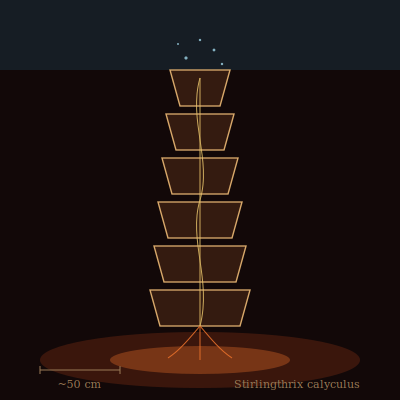

## Anatomy

A stack of six to nine nested chitin-ceramic bells, each a shallow bicone pinned to the next by a central guttersucker stalk, the whole tower half a meter tall and rooted in a sulfide chimney. The lowermost bell sits in 360°C vent brine; the uppermost crown floats in 4°C abyssal water. Between the two ends runs a closed loop of eutectic water-ammonia laced with dissolved iron sulfide — it flash-boils in the basal chamber, rises as a two-phase pulse through the stalk, condenses against the cold crown, and drains back down a return channel. There is no gut: metabolism is powered by the pressure-volume work of that cycle, with mineral substrate dissolved directly off the chimney wall by acid-secreting rootlets and assimilated through the stalk wall.

## Behavior

Stirlingthrix are sessile after settlement and die if displaced from a thermal gradient exceeding ~200°C per meter, so they compete fiercely for chimney lips. The pumping cycle doubles as a tidal flush: each condensation pulse drives spent fluid out through the bell rims, carrying a faint acoustic throb at roughly one hertz that gives a mature field its characteristic low heartbeat. They reproduce only on the death of a neighbor — when a chimney cools or a tube collapses, the nearest adult superheats its crown and ejects a spray of motes, droplets of working fluid each wrapping a spore-coated nucleator crystal; motes that land on a fresh hot-cold boundary germinate into a new bell within a week.

## Myth

Vent-divers claim the throbbing of a Stirlingthrix field is the world's own pulse slowed to hearing, and that a diver who matches their breath to it can pass between the bells without scalding. Some hold the older lie: that the first bell was grown by a drowned engineer who refused to stop working.
