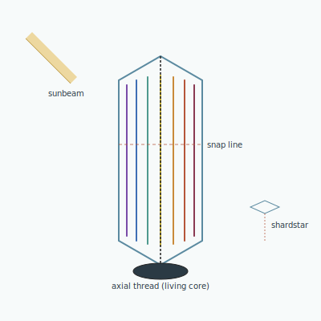

## Anatomy

A hollow hexagonal prism of biogenic ice, waist-high, that hangs vertically in the Rime from a dense brine ballast at its base. The walls are salt-doped into a dispersive prism: a sunbeam entering one face is split into a spectrum that paints the inner walls in seven vertical stripes, each stripe a monoculture of photosynthetic symbiont tuned to one wavelength — violet sulfur-bugs at one edge, far-red nitrogen-fixers at the other. The organism proper is neither ice nor symbionts but the hair-thin melanin thread running down the central axis, the only part that is truly alive: it harvests the sugars each stripe exudes and weaves them into more thread, more ice, more ballast.

## Behavior

It orients to the sun by melting its up-sun wall slightly faster than the down-sun wall, weather-vaning the whole prism to keep the beam centered on the axis. As it grows taller the center of mass rises until a thermal gust snaps it; the top half, carrying a fragment of central thread, shears off and falls through thin air — slowly, melting and refreezing — and nucleates a new individual wherever it lodges in lower cloud. A single Lightsplitter may shed a dozen of these "shardstars" in a lifetime, each daughter tuned to a slightly different spectrum depending on which stripe's thread survived the break.

## Myth

Rime anchorites hold that the Lightsplitter is not an animal but a prayer the sky is saying back to the sun — seven colors being the seven true names of light, repeated until the sun answers. A year with no shardstars, they say, means the sun has stopped listening.
