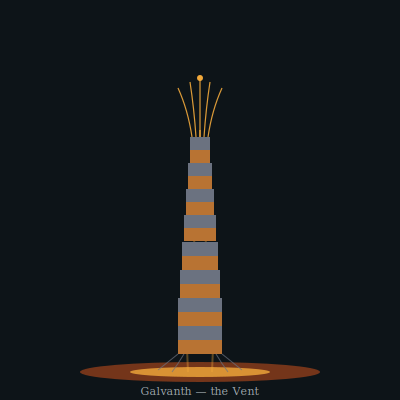

## Anatomy

A Galvanth is a slender tapering column two to three meters tall, anchored at the lip of a geothermal fissure and built from hundreds of stacked rings of biogenic sulfide tissue, each ring a junction of two dissimilar metal salts — chalcopyrite and sphalerite variant — laid down alternating like the cells of a battery. Hot brine rises through a central flue while cold ambient Vent water bathes the outer skin, and the gradient across each ring drives a slow DC current through the stack; the animal is, literally, a living thermopile, its metabolism the harvested voltage. A crown of electroreceptive cilia pivots atop the column, tasting the local current field, while filamentous roots creep down into the chimney wall, mining fresh metal sulfides to re-grow rings as the brine erodes them. There is no gut, no mouth, no symmetry but the vertical — only the junction and the gradient it straddles.

## Behavior

It is sessile but not still: the crown pivots over hours to face the peak gradient, and the root-filaments renegotiate the chimney nightly, abandoning eroding rings and laying new ones higher. Reproduction is slag-budding — when a ring overheats or short-circuits, the tissue above it sloughs as a molten droplet of sulfide that re-anneals downstream on a fresh fissure, its surviving symbiont-miners bootstrapping a new column within a season. Anything that bites through a ring shorts the thermopile and kills both parties, so the Galvanth has no predators and no defense beyond the lethality of its own body; its only companions are the mining-worms that live in the flue, cleaned of mineral crust in exchange for a trickle of current. A mature Galvanth hums faintly in the electromagnetic — a DC signature other Galvanth orient by, and that Vent-skimmers navigate the dark to avoid.

## Myth

Vent-divers read the Galvanth's hum as the Drift's own heartbeat, the landmasses keeping time through their fissures. A chimney where the columns fall silent is called a dead current — never dived, said to mark where the world is cooling and the land will eventually drop out of the sky.
