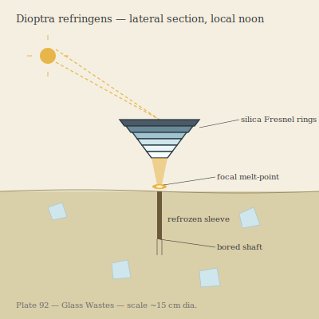

## Anatomy

A flat biomineralized disc the width of two spread hands, shaped like a hand-ground Fresnel lens: concentric stepped rings of precipitated silica, dark iron-manganese around the rim and glass-clear at the center. There is no distinction between body and optical element — the lens *is* the animal. The underside is a black, glandular foot that secretes a thin film of alkali solvent, and a ring of chemosensitive cilia traces the rim, reading the composition of whatever glass it rests on. It has no mouth; it eats through the bottom, where its own focused beam meets the sand.

## Behavior

Dioptra lies flat on a glass dune and tracks the sun by slow tilt of its rings, holding a pinpoint of concentrated light on the sand directly beneath its center. The focus reaches melt temperature in seconds: the glass softens, releases trapped volatiles and reduced organics, and the foot absorbs the liquor through the solvent film. As it feeds it sinks — boring a shaft exactly its own diameter, perfectly vertical, the walls refreezing behind it into a smooth sleeve. It descends meters in a day, then claws back up at dusk by reversing its solvent to etch the sleeve walls thin and shatter them. To move laterally it tilts fully onto its rim and rolls downwind, a behavior indistinguishable from a tumbling shard of glass.

## Myth

Glass Wastes caravans navigate by Dioptra, never by the sun: the lens always points exactly solar, so the axis of its shaft reads true noon to the minute. Travellers call them "the sun's footprints" and believe the Wastes themselves are an immense Dioptra that bored through the world and left only the shaft behind — which is why, they say, the sand here is glass and not stone: it is the refrozen wall of a hole that goes all the way through.
