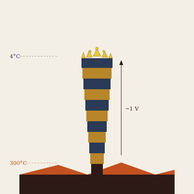

## Anatomy

Galvanocaulis is a vertical chimney-stalk, 30–80 cm tall, rooted in the 300°C anoxic brine of a fissure and rising through the thermocline into 4°C oxygenated seawater — its entire body spans the gradient that feeds it. The wall is a stack of several hundred alternating rings of biogenic chalcopyrite and sphalerite, each pair a thermocouple; the whole stalk is a living thermopile generating nearly a volt across its length, every ring electrodeposited from the metal-sulfide plume by the very current it produces. There is no gut, no mouth: metabolism is the directed corrosion and precipitation of dissolved vent metals, and the animal excretes pure sulfur crystals from its crown as a slow yellow rime.

## Behavior

A specimen is immobile once its basal plug cures into the fissure substrate; it grows only at the crown, lengthening toward the sharpest remaining thermal boundary and bending away from neighbors, because the electric fields of two adults interfere destructively and stunt one another — this electrostatic repulsion spaces Vent chimneys into near-regular lattices across a field. It filters nothing and chases nothing; the voltage drives ciliary currents that draw plume water across its mineral skin, leaching ions it cannot self-supply. When a fissure cools or migrates and the gradient collapses, the stalk depolarizes in minutes and releases a cloud of electrotactic larvae — microscopic thermocouple filaments that drift inert in isothermal water but, on contact with any new gradient, self-orient rootward-hot and crownward-cold and begin to electrodeposit their first ring.

## Myth

Vent-divers call a standing field of Galvanocaulis the Deep Wiring and swear the regular spacing is not chance but circuitry — that the Drift thinks, slowly, in the dark, by the voltage of its own cooling. A thunderstorm directly above a known Vent field is said to be the discharge of a lattice that has finally completed, and the sulfur rime collected from a fallen crown is kept as a charm against being struck.
