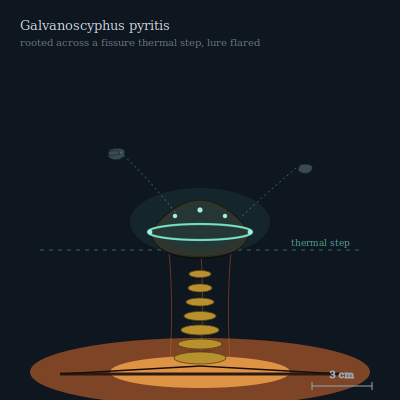

## Anatomy

Galvanoscyphus is a stalked chalice that roots itself precisely on the lip of a hydrothermal fissure, its body straddling the boundary between 340° vent brine and 4° ambient abyssal water — the only geometry in the Drift where a living thermocouple is viable. The stem is a column of stacked pyrite discs that act as bimetallic junctions in series; the cup is a parabolic bowl of conductive greigite lined with electrogenic biofilm that converts the thermal step into a steady half-volt of current. There is no mouth and no gut: sulfide is oxidized at the hot foot and the electrons climb the stem to a halo of bioluminescent bacteria in the rim, which pulse a cold blue-green visible for tens of meters in the Vent's absolute dark.

## Behavior

It lures. Vent-endemic shrimp and copepods drawn to the rim-light receive, on contact, a 200-millisecond galvanic pulse that locks their musculature in tetanus, and the cup inverts — a sphincter closure driven not by muscle but by electrochemical swelling of the greigite matrix, slow enough that the prey is still alive when digestive acid floods the sealed chamber. The same current powers a faint electrolocation field; in the lightless water the chalice can map a passing body the size of a fist and decide, in the span of a heartbeat, whether to flare the lure brighter or go dark. Reproduction is by detachment: a daughter cup buds from the rim, drifts negatively buoyant on a hydrogen bladder, and resettles only where it can straddle a fresh thermal step; outside a gradient it dies within hours.

## Myth

Vent-divers call the constellations of cup-lights along a fissure field a "foundry floor," and swear the oldest chalices — those rooted across the same step for a century — ring in harmony, their pulse rates phase-locking into a slow chord you feel in your teeth long before you see them. They are never to be touched: a hand across the rim completes the circuit through the diver's own blood, and the unlucky wake hours later with no memory and a coin-shaped white burn that never tans.
