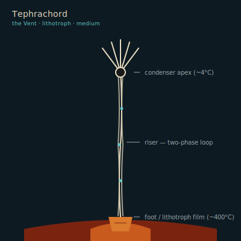

## Anatomy

A slender vertical spire, 1.5–2 m tall, that bridges the full thermal gradient between vent jet (~400°C) and ambient deep water (~4°C). The body is a bundled sheaf of sealed capillaries filled with a sulfur-iodine brine working fluid that boils at the hot foot and condenses at the cold apex, driving a continuous phase-change circulation with no heart and no neuromuscle. The foot is a bright mineralized grip pad of iron-sulfide scale, wedged into the fissure wall; the apex is a fat matte-black condenser radiator fanning into the cold current. Between them the riser is flexible, braided, faintly luminescent at the nodes where vapor collapses back to liquid — the organism's only light. A film of thermoacidophilic lithotrophs lines the foot, dissolving sulfides from the vent rock; everything above the foot is just plumbing.

## Behavior

It climbs the fissure like an inchworm: release the foot, loop the riser, re-anchor a few centimeters up or along — but never breaks span across the gradient, because without the boil-condense loop it goes flaccid and drifts. Territory is the fissure itself; two tephrachords sharing a vent braid risers until one starves on reduced sulfide flux and detaches, drifting until it finds a new jet. Reproduction is apical: the condenser buds a dense seed-capsule that sinks, lodges in a fresh fissure, and grows foot-first, then riser, then condenser — only founding a new spire if the gradient is steep enough to drive the first boil.

## Myth

Vent-divers call a mature tephrachord a "chordline" and belay their descents on its taut riser, trusting the gradient to hold the line stiff. A slack chordline is an omen: the vent is dying, and so is everything living off it — divers who ignore a slack line are said to be "following it down."
