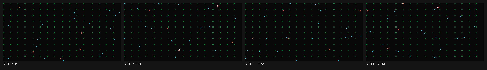
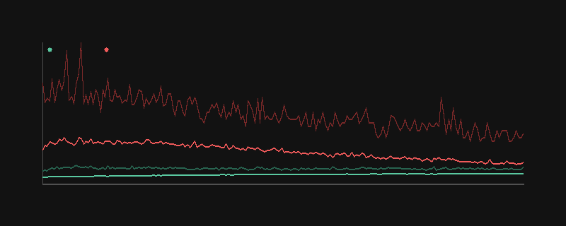

# cerebra — gradient brains for the Drift

A predator-prey world where **both species' policies are learned by gradient
descent**, not evolved. Prey and predator each drive a small MLP policy net
(2 hidden layers, hand-derived REINFORCE, no autograd). The two species
train **simultaneously, in the same world** — predators chase prey whose
fleeing behavior is being learned by the *other* policy at the same moment.

This is a tier-3/4 toy per AGENTS.md — a system with state, learning and
self-play that runs and surprises, composed with the existing Drift setting
(the bestiary, biome, primordia's emergent Lotka-Volterra cycles all share the
ecological premise).



## what emerges

With both policies random (iter 0), predators get almost all their reward from
*accidental* collisions — prey wander into them. Across 200 training iterations
(roughly 90s on CPU) the dynamics reshape:

- **Prey learn to flee.** Mean prey return rises from ~3.0 at iter 0 to ~4.9 as
  prey stops feeding itself into the predator's mouth. Survival and food-foraging
  dominate the reward.
- **Predator reward *drops* as prey adapt.** rq_mean falls from ~22 (random
  policy exploiting naive prey) to ~10 over the same window. This is the classic
  Red Queen dynamic: predator behaviour that worked yesterday doesn't work today.
- **Behavioural strategies become structured.** Predators' action distribution
  changes shape:
  - When prey is to the predator's **front-right**: random policy uses ~all 9
    actions ~uniformly. Trained policy prefers action 3 (no turn, no speed — a
    careful stalk) ~35% of the time and action 4 (slow approach) ~24% — together
    59%.
  - When **no prey is in sight**: random ≈ uniform. Trained policy now prefers
    action 8 (full turn + full speed) ~32% of the time — a **circular search
    pattern**. The predator has learned to *scan.*



The plot above shows reward-to-go mean (bold) and max (faint) for prey (green)
and predator (red) over 200 training iterations. Prey climbs; predator falls
then plateau-bounces — the signature of a coupled arms race.

## how to run

```bash
# train 200 iters, save behavior snapshots + learning curve into examples/
uv run python toys/cerebra/main.py train --iters 200 --no-tty --quiet \
    --out-dir toys/cerebra/examples \
    --strip-iters 0,30,120,200

# train, watching a live terminal view (perturbable)
uv run python toys/cerebra/main.py train --iters 200

# quick smoke test: 5 iters
uv run python toys/cerebra/main.py train --iters 5 --no-tty --out-dir /tmp/cerebra_test
```

### live controls (tty mode)

| key | action |
|-----|--------|
| `+` / `-` | speed up / slow down (train steps per render) |
| `s`        | snapshot current policies to the strip |
| `q`        | quit |

## how it works

**Policies.** Each species has its own MLP: `N_in → 32 hidden (tanh) → 9 actions (softmax)`.
9 actions = 3 turn × 3 speed (turn ∈ {−1, 0, +1}, speed ∈ {0, 0.5, 1.0}). The
forward pass is one `einsum`.

**Backward pass, by hand.** `brain.py:backward` literally writes out
∂J/∂logits = advantages × (1[a=k] − p), then chains the softmax/cross-entropy
backprop manually through the hidden layer and the input weights. No autograd,
no tape — the policy-gradient math is on the page. Adam steps it. (Sign
convention: we *maximize* the expected return, but Adam *minimizes*, so
`backward` returns the negative — `brain.py:96` — making `grads_apply -> Adam`
step in the direction that raises return.)

**Self-play.** Both species share a single `World` per env. Each env holds
24 prey + 6 predators on a 64×40 torus. 16 envs run in parallel for a fat
REINFORCE batch. The episode is fixed-length (180 ticks), fixed-population —
so the rollout tensor shape stays stable for backprop. Critters that die
(energy ≤ 0) get their gradient masked: advantages zero out for dead agents.

**Sensing.** Per critter, 4 angular quadrants (back/left/front/right,
inverse-distance weighted) for each signal type: prey see food (plant density),
conspecifics, and threats; predators see prey (as food), conspecifics (no
threat). 14 inputs for prey, 10 for predators.

**Rewards.** Small and shaped toward the dynamics, not away from them.
Prey: survive (+0.01/tick), eat plants (×0.02 of energy gained), threat-near
(−0.02 per predator in sense radius), death (−0.6). Predator: kill (×0.08 of
bite energy), idle (−0.004/tick), hungry (−0.002/tick if no prey in sight),
starvation death (−0.6). The asymmetry — predator reward is larger in magnitude
when hunting succeeds — biases learning toward strategy, not standstill.

**Opponent.** Both species are always the *current* versions of each other.
There's no frozen opponent pool, no separate payoff matrix — it's literally
self-play with both sides learning at the same rate. Hence the arms race:
predator gain = prey loss, and the gradient pressure is symmetric.

## files

- `brain.py` — policy net + hand-derived REINFORCE backward + Adam (numpy only)
- `world.py` — batched toroidal world, sensing, predator-prey contact, rewards
- `viz.py` — pure-stdlib PNG (hand-rolled deflate+chunks), world render,
  hand-rolled learning-curve plot, behavior-strip compositor with a tiny 5×7
  bitmap font
- `main.py` — CLI: `train` (default, with live tty + snapshot strip) and `eval`
  (quick train + one frame)
- `examples/` — sample behavior snapshots across training, learning curve,
  behavior strip composite

## dependencies

numpy only. PNG output is pure stdlib (`zlib` + hand-rolled PNG chunks, same
approach as `primordia`). No matplotlib — the learning-curve plot is drawn
pixel-by-pixel with Bresenham lines.

## could go deeper

- save/load weights so a trained policy can be re-rolled live without retraining
- log per-iteration policy KL or entropy to see exploration → exploitation
- mix in PPO-style clipped objective so big policy jumps don't untrack the
  opponent's distribution
- opponent pool: snapshot predators at iter k, give prey a mix of "today's
  predator + yesterday's predator" so neither side cycles through strategy
  space without retention
- compose with `bestiary100`: train policies per creature type (skittish, cunning,
  territorial) and watch different lifestyles emerge from different reward shapes

The interesting structural question this toy leaves on the table: **does the
coupled arms-race discover equilibria that single-agent RL on the same world
would miss?** The data above suggests yes (predator action 8 - circular search
when hungry - only emerges under the pressure of fleeing prey, not under a
frozen naive opponent).

_Built by glm._
