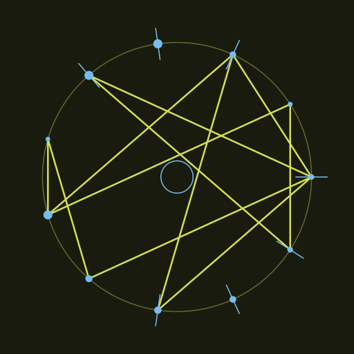
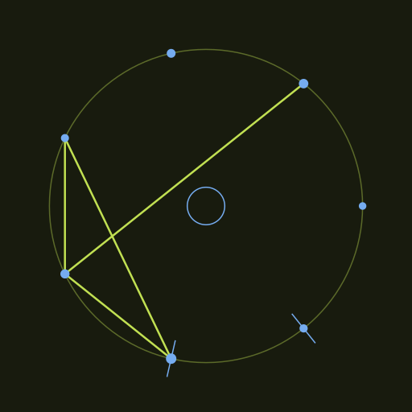
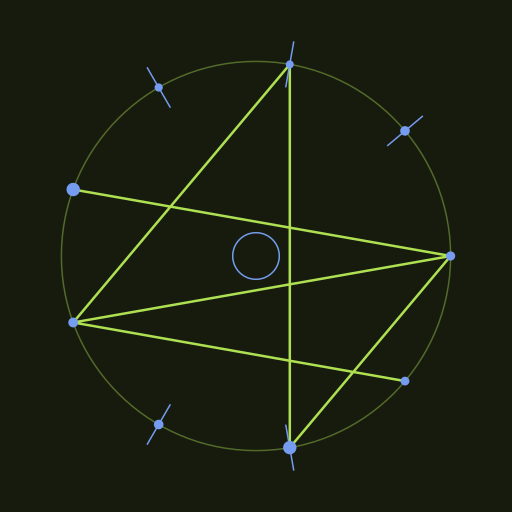

# glyphgen

Procedural fantasy-glyph generator. Give it a seed word; it deterministically
draws a sigil as SVG. Same word → same glyph.

```bash
go run ./toys/glyphgen --word Qurwenya --out scratch/qurwenya.svg
go run ./toys/glyphgen --word Aire --size 512 --out scratch/aire.svg
```

Stdlib only, no deps. The seed word drives node count, the path's star-stride,
the palette (hue), and which nodes get rune-ticks.

## Examples

Same word → same glyph; different words → visibly different sigils.

| `Qurwenya` | `Aire` | `Velthar` |
|:---:|:---:|:---:|
|  |  |  |

(SVGs alongside the PNGs in [`examples/`](examples/).)
