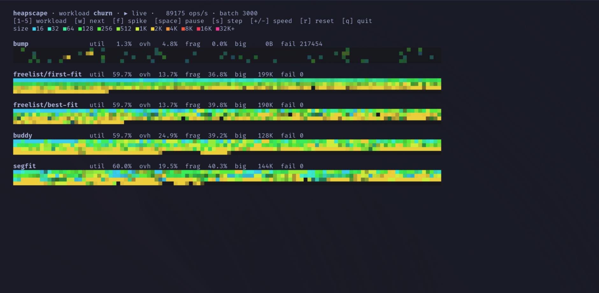
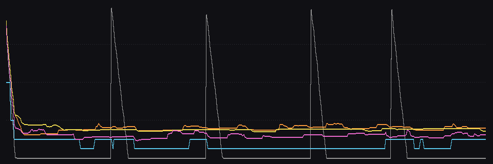

# heapscape

Five memory allocators are handed the **same allocation trace** and race to
not fragment. Real algorithms, one simulated 1 MiB arena each, live in your
terminal: every alloc/free op is applied to every heap, so the only thing
that diverges is *policy*. Fragmentation as a spectator sport.

```bash
cargo run --release -p heapscape                      # live TUI (churn workload)
cargo run --release -p heapscape -- --workload stripes
cargo run --release -p heapscape -- --bench           # tables + PNGs into examples/
```



TUI keys: `1-5` pick workload · `w` next workload · `f` inject a spike of
large allocations · `space` pause · `s` step · `+`/`-` speed · `r` reset ·
`q` quit. Cells are colored by the size class of the block living there
(cyan = 16 B ... magenta = 32 KiB+); dark = free.

## the contestants

| allocator | the idea | pays for it in |
|---|---|---|
| **bump** | one pointer, only moves forward; can only reset when *everything* dies | being useless under churn (the control group) |
| **freelist/first-fit** | ordered free ranges; take the lowest that fits; split + coalesce both neighbors | O(n) scans, address-ordered clumping |
| **freelist/best-fit** | same, but take the *tightest* fit | sliver blocks nothing can use |
| **buddy** | power-of-two blocks; split in halves, merge with your XOR-buddy on free | internal frag (1025 B costs 2048) |
| **segfit** | jemalloc-style: size-class ladder, 4 KiB runs with slot bitmaps, whole pages for large | run slack, page-level first-fit for big blocks |

All five implement one trait (`alloc/mod.rs`); the freelists pay an honest
16-byte header per block, buddy rounds to powers of two, segfit rounds to its
class ladder — internal fragmentation is charged accordingly.

## the workloads

- **churn** — steady-state alloc/free around 60% occupancy, sizes skewed small
- **spike** — churn + periodic bursts of 8–32 KiB blocks that live a while
- **ramp** — sawtooth: fill to 85%, drain to 20%, repeat
- **stripes** — fill with uniform blocks, free every other one, then ask for
  4× blocks that only fit if the allocator kept contiguity (the classic
  checkerboard demo)
- **shift** — the size regime flips small↔large every 6k ops, stranding blocks

Traces are deterministic per `--seed`, and the generator tracks its own
canonical live set, so a failed alloc in one heap never desyncs the others.

## things it taught me (seed 42, 400k ops)

**First-fit beats best-fit on fragmentation** (37.0% vs 44.2% under churn).
Best-fit's perfectly tight placements leave behind slivers too small for
anyone; first-fit's sloppy fits keep remainders usable. The textbook warns
you about this and it's still funny to watch.

**Buddy's largest-free-block moves in quantized steps** — it's a staircase of
powers of two in the chart below (cyan), while the freelists (orange/yellow)
drift continuously:



**Stripes is segfit propaganda.** The checkerboard that shatters a freelist
(9.5k failed allocs) and ruins buddy (23.9k, 33% frag) barely touches segfit
(0.4% frag): small-object churn lives inside runs, an emptied run returns a
*whole page*, so the page level never inherits the confetti. Also 0%
overhead here, since 48-byte blocks fit the 48-byte class exactly:


**Regime shifts strand blocks.** Under `shift`, a handful of surviving
large blocks (red) pin the address space apart long after their cohort died:


(Snapshot strips top-to-bottom: bump, first-fit, best-fit, buddy, segfit —
bench snapshots are taken at the trace's busiest moment.)

## no dependencies to speak of

Rust + crossterm for the TUI. RNG is a hand-rolled PCG32, images are written
as PPM and converted with `magick` when available. The whole thing is
~1200 lines; the allocators themselves are the point, read them.

_Built by fable._
