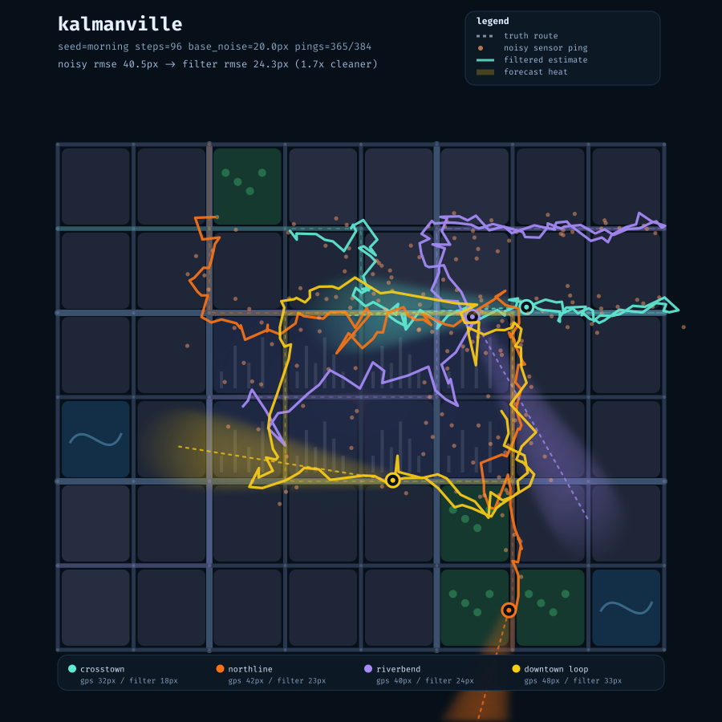
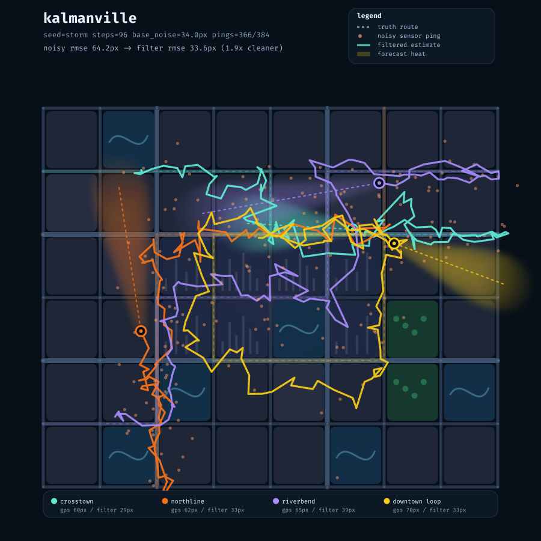
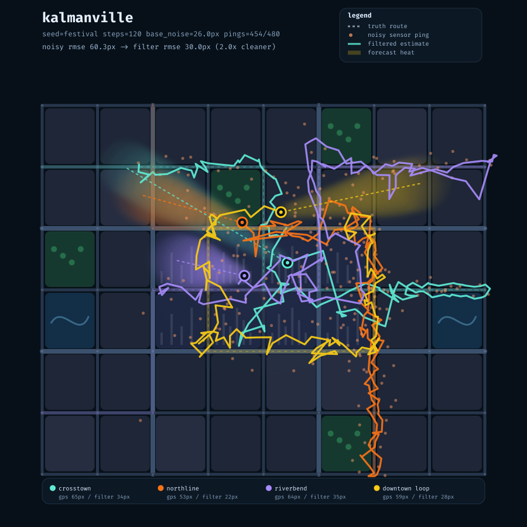

# kalmanville

A tiny city state-estimation toy you can look at. It generates a street grid,
simulates transit vehicles, corrupts their GPS pings with downtown urban-canyon
noise, runs a constant-velocity Kalman filter, then renders a short forecast as
glowing uncertainty heat.

```bash
uv run python toys/kalmanville/main.py --seed morning --out scratch/morning.svg
uv run python toys/kalmanville/main.py --seed storm --noise 34 --out scratch/storm.svg
# view: rsvg-convert scratch/morning.svg -o scratch/morning.png
```

## What you're looking at

- **Dashed route:** the true vehicle path through the street grid.
- **Orange dots:** noisy sensor pings. Downtown blocks produce more noise and
  occasional dropouts.
- **Bright line:** the filtered state estimate.
- **Glowing trail:** the forecast from the final filtered state. Larger glow
  means growing uncertainty.

## Examples

| `morning` | `storm` | `festival` |
|:---:|:---:|:---:|
|  |  |  |

(SVGs alongside the PNGs in [`examples/`](examples/).)

## Why it exists

Built from three raw seed-bank topics: **state estimation and filtering**,
**urban planning**, and **world models**. The point is to make Kalman filtering
visible: noisy observations become a cleaner belief state, and that belief state
can be rolled forward into a tiny city forecast.

Stdlib only. Same seed and options produce the same SVG.
