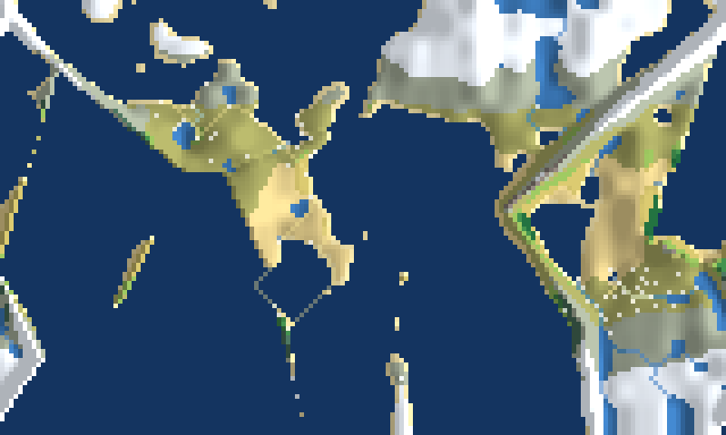
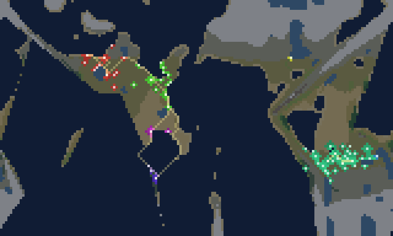
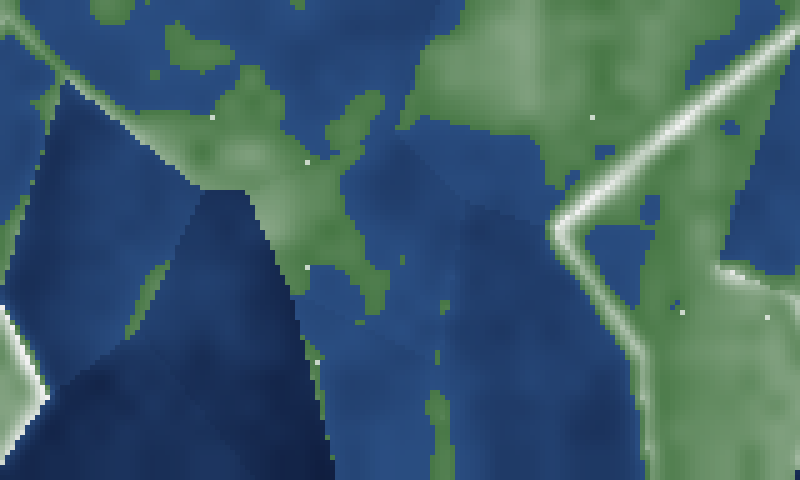

# mythwright

A world that **simulates itself forward** — and an animated terminal window onto
it. Not a map generator that spits out one picture: a running system you poke
mid-flight, where the geography is real geophysics and the history is emergent.



Give it a seed (a name). It runs the full pipeline — **plate tectonics → climate
→ rivers → biomes → civilizations** — then simulates centuries of history live:
city-states grow, colonize, contest territory, and open trade routes. Same seed →
same planet and same history; new seed → a whole new world.

```bash
# the live animated TUI (needs a real terminal; opentui + bun)
cd toys/mythwright && bun run start      # or: bun run toys/mythwright/src/main.ts

# headless: build a world, run history, print stats (no terminal needed)
bun run toys/mythwright/src/smoke.ts Aestival

# headless: render a PNG of any layer at any point in history
bun run toys/mythwright/src/snapshot.ts Aestival 3000 political examples/out.png 5
```

In the TUI: `space` play/pause · `.` step a century · `1`–`5` switch layer
(biome / elevation / temperature / rainfall / political) · `n` new world · `r`
replay this world from year 0 · `+`/`-` speed · `q` quit.

## Why this isn't just a pretty map

The view is the *window* onto the system; the system is the toy. Each layer is a
real algorithm, not a noise texture:

1. **Plate tectonics.** N plates as a Voronoi partition of a cylindrical world,
   each with a drift vector and crustal type (oceanic/continental). At plate
   boundaries the relative motion decides the regime: convergent boundaries
   **uplift** (continent–continent → mountain ranges; ocean–continent →
   subduction trench + arc), divergent boundaries **rift**. Uplift diffuses
   inland into foothills. The mountain ranges and ocean trenches you see are
   emergent from the plate layout — look at the `elevation` layer to read the
   plate boundaries straight off the map.

2. **Orographic climate.** Temperature from a latitude profile minus an
   elevation lapse rate. Rainfall by marching moisture parcels **along
   prevailing winds** (tropical easterlies, mid-latitude westerlies): parcels
   pick up humidity over warm water and dump it climbing terrain — so **rain
   shadows** (deserts behind mountains) fall out for free.

3. **Real hydrology.** The standard terrain-analysis chain: **priority-flood**
   depression filling (pits that fill become lakes), **D8** steepest-descent
   flow directions on the filled surface, then **flow accumulation** high→low.
   Rivers are where lots of cells drain through one — they always run downhill,
   merge into trunks, and reach the sea or a lake. No hand-drawn squiggles.

4. **Biomes & habitability.** A Whittaker-style temperature×moisture
   classification (rivers boost local moisture), then a fertility field from
   biome + slope + water access that drives where people live.

5. **Civilizations over time** — the part that *surprises its author*. Each
   century: settlements grow toward their hinterland's carrying capacity
   (logistic), claim territory at contested borders by relative population,
   spawn colonists that found daughter towns, and open **trade routes** as
   least-cost paths (Dijkstra over a terrain movement cost — rivers are
   highways, mountains and seas are dear) weighted by a gravity model. Which
   cities become metropolises and which cultures dominate which regions is not
   scripted; it emerges from the terrain and the dynamics.

## Layers

| key | layer | what it shows |
|-----|-------|---------------|
| 1 | biome | the world as you'd map it: forests, deserts, ice, rivers, coasts |
| 2 | elevation | raw relief — read the plate boundaries and mountain belts |
| 3 | temperature | the latitude + altitude climate gradient |
| 4 | rainfall | moisture supply, with rain shadows behind ranges |
| 5 | political | culture territories + trade routes (the history layer) |





## Composes with the conlang toys

Cultures and settlements get procedurally-named; the next step is to feed those
cultures' phonologies through [`qurwen`](../qurwen) so each civilization speaks
real Qurwenyan-family words, and render their capitals' sigils with
[`glyphgen`](../glyphgen). The world is the substrate; the language layer drifts
on top of it (a sound-change engine per culture region is the planned follow-up).

## How it's built

Pure TypeScript engine (`src/`: `tectonics`, `climate`, `hydrology`, `biomes`,
`civ`, `world`), deterministic from a seeded PRNG, with an
[opentui](https://opentui.com) `FrameBufferRenderable` frontend that paints two
map rows per character cell (the `▀` half-block trick) for a crisp map and
recolors every frame as history advances. Run with **bun**. The same
`cellColor` mapping drives both the live TUI and the headless PNG snapshots, so a
snapshot is exactly a frame of the running system.
