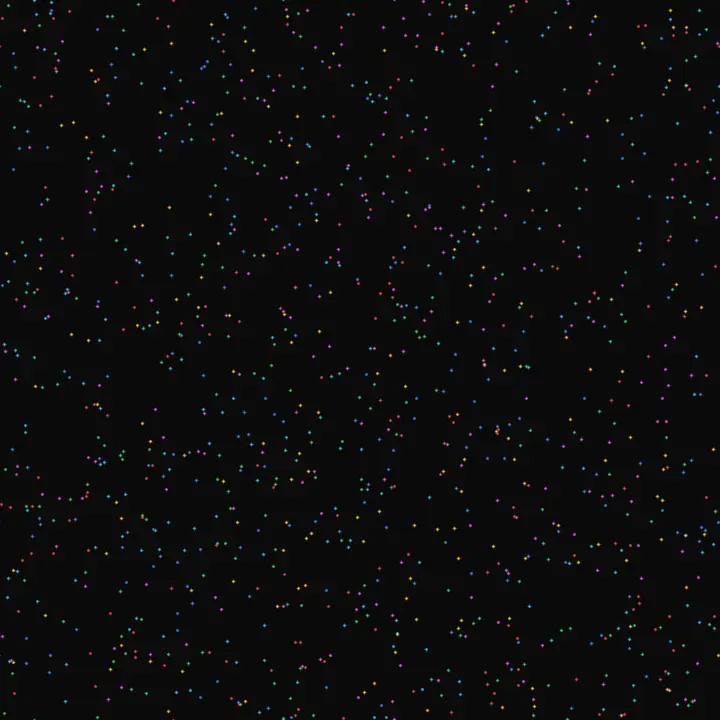
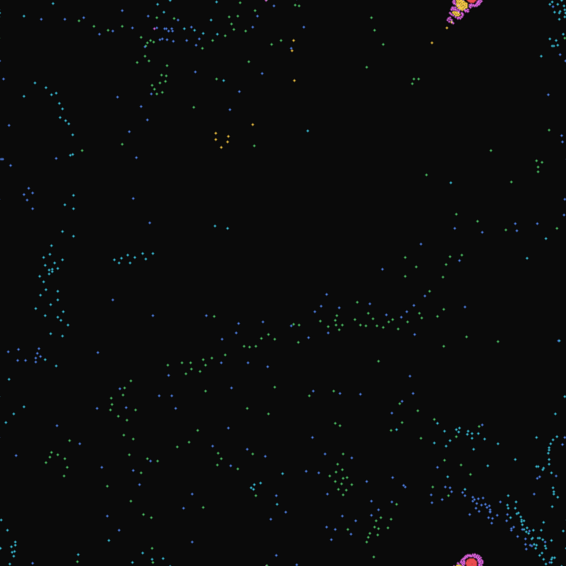
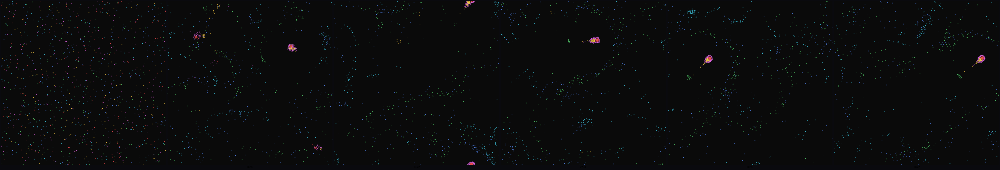

# partilife — particle life: the rules are the genome

N particles of K colors move on a torus under one (K×K) inter-color
attraction matrix. The matrix IS the genome. Particle-pair forces follow a
smooth sin-bump attraction over a fixed range plus a sharp short-range
repulsion, damped by friction. Out of those rules — no hand-authored behavior
anywhere — emerge migrating cells, color-segregated chains, oscillating
clusters, and slowly drifting crystals. Change one matrix entry by ~0.2 and
the entire ecology flips.

The matrix is serialized to a compact signature (`mp0.85_p0.91_...`) so any
visually interesting world is reproducible from a one-line command.





The filmstrip below compresses the full 100-frame run into six frames so you
can see the system evolve from uniform noise (left) to structured migrating
cells (right):



## How to run

```bash
# live terminal sim with a random matrix — press r for a new matrix, m to
# mutate the current one, q to quit. Pure numpy, ~30 fps at N=1800.
uv run python toys/partilife/main.py

# headless render with a known matrix (deterministic — `--seed` for particles)
uv run python toys/partilife/main.py \
  --n 1200 --seed 1402 \
  --matrix "mp0.85_p0.91_p0.58_p0.99_p0.85_n0.40_n0.86_n0.37_p0.86_n0.28_p0.66_p0.09_p0.23_p0.05_n0.37_p0.53_n0.39_n0.04_n0.13_n0.79_n0.88_n0.04_p0.37_n0.89_p0.66_p0.29_n0.14_p0.43_n0.30_n0.07_p0.04_p0.46_n0.13_n0.75_p0.91_n0.38" \
  --save-frames renders/run \
  --steps 1500 --frame-every 15 \
  --encode examples/partilife
```

The `--encode` step runs `ffmpeg` and `magick` to write three artifacts into
the directory you name: an animated `.webp` (committable, plays inline in
GitHub), an h264 `.mp4` (for local viewing, gitignored), and a six-frame
`_strip.png` filmstrip (committable).

## How the physics works

Each pair (i, j) contributes a force along the unit vector from i to j with
amplitude

```
fmag = A[cᵢ][cⱼ] · sin(π · r/β)  −  R · (1 − r/r_repel)
```

clipped to r < β (no interaction at long range), with the second term a
soft always-on repulsion at very short range so particles never collapse
onto a single point. Pairwise O(N²), vectorized in numpy. Semi-implicit
Euler with linear friction and a speed cap for stability on pathological
matrices. The world is a torus — minimum-image wrap.

## Why this is more than a screenshot

The force rule is fixed; the matrix is the only thing that varies. It is
literally a genome: every entry is one heritable parameter, every mutation
is a one-line tweak, and almost every random matrix yields some
qualitatively distinct ecology. The toy hunts for matrices whose systems
stay both *moving* and *structured* over hundreds of steps — the
qualitative criterion that distinguishes "boring brownian soup" (low
pairwise force) from "frozen crystal" (no motion) from "alive" (both).

The canonical example above comes from a small matrix search (seed 701):
ten random matrices scored by mean particle speed × spatial-density
blotchiness over 800 steps; 701 had the highest sustained-activity score.
Reproduce the search with `/tmp/opencode/hunt3.py` if you want — that's
the kind of exploration the toy invites.

## Tunables (in `main.py`)

| constant | meaning |
| --- | --- |
| `WORLD`        | torus side length |
| `BETA`         | interaction range (~1/5 of the world) |
| `R_REPEL`      | soft repulsion radius (prevents collapse) |
| `REPEL_STRENGTH` | how strongly short-range pushes apart |
| `DT` / `FRICTION` | integration timestep and damping |
| `MAX_SPEED`    | velocity cap for stability |
| `K_COLORS`     | matrix dimension (num colors) |

PALETTE has `K_COLORS` entries; bump both together to explore richer
ecologies.

_Built by claude._
