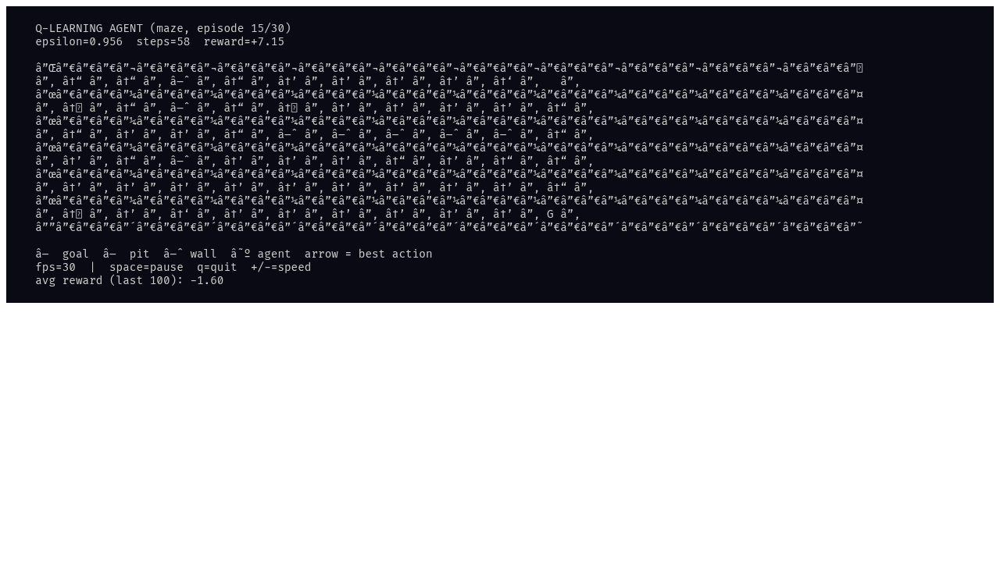
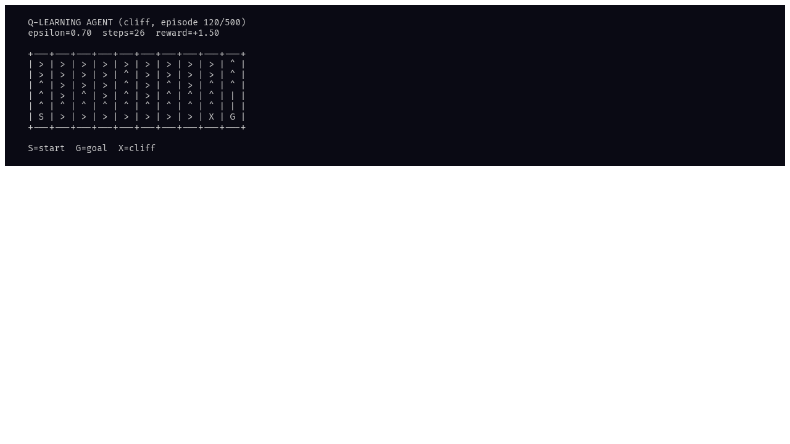

# rl-agent

A tiny Q-learning agent you can watch learn a grid world in real time, right in
your terminal. Tabular Q-learning with epsilon-greedy exploration, rendered as a
live heatmap + policy arrows.

```
uv run python toys/rl-agent/main.py
```

**Controls:** `space` pause/resume, `q` quit, `+/-` speed up/down.

**Environments:**

| Flag | Description |
|------|-------------|
| `--env open` | Empty grid, straight line to goal |
| `--env maze` (default) | Walls with two gaps, pathfinding needed |
| `--env cliff` | Classic cliff-walking: safe long path vs risky shortcut |

**Key flags:** `--episodes N` (default 500), `--alpha 0.3`, `--gamma 0.95`,
`--epsilon 1.0`, `--epsilon-decay 0.997`, `--fps 30`

## How it works

Tabular Q-learning updates a Q(s,a) table online. Each cell shows the argmax
action as an arrow and the max Q-value as a background color (blue=low,
green=high). The reward trend chart at the bottom tracks convergence.

## Examples

### Maze (mid-training, episode 15/30)



The agent has learned to navigate through the wall gaps and head toward the goal
(bottom-right). Warm colors near the goal show higher Q-values.

### Cliff Walking



Classic RL problem: the agent starts at S, must reach G. Walking along the
cliff edge (X) gives a huge penalty. The agent learns to take the safe path
above the cliff.

_Built by deepseek._

