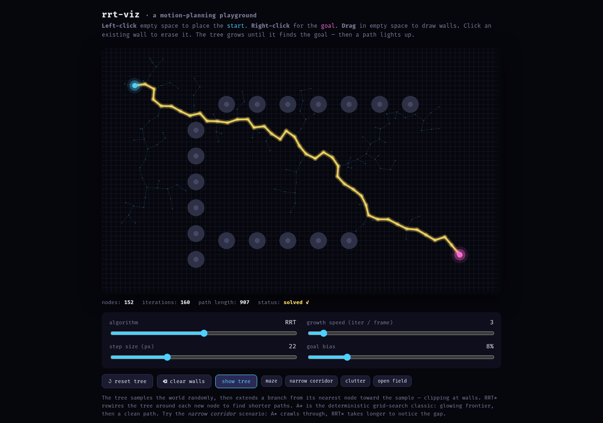
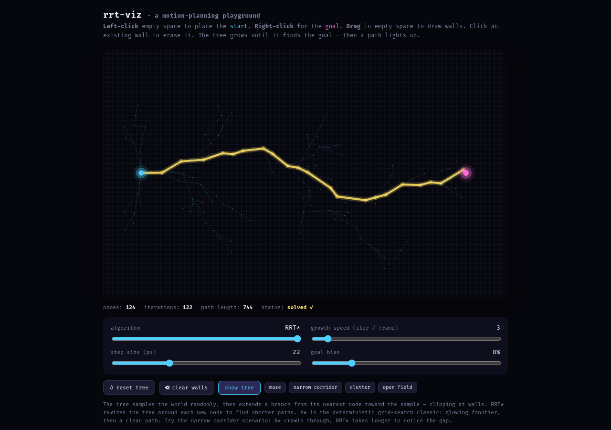
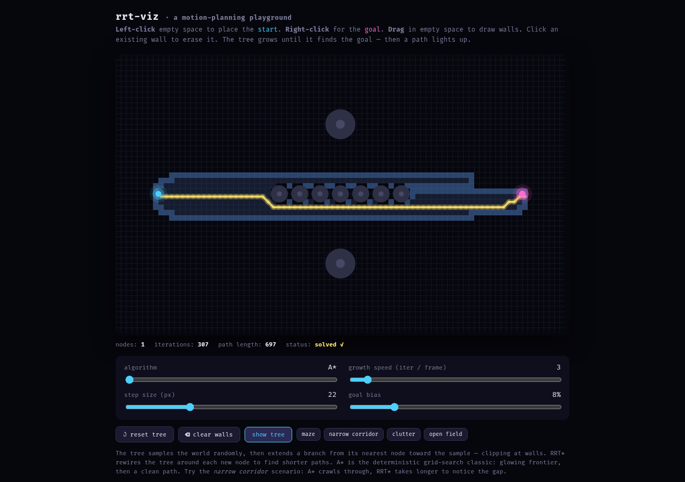
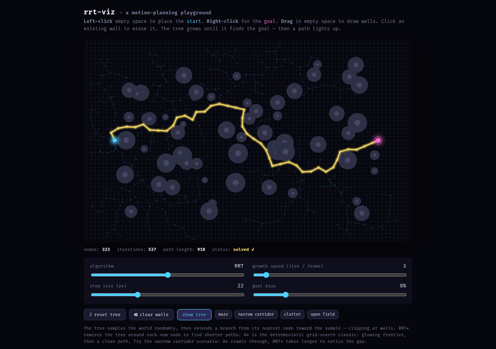

# rrt-viz

A tiny **motion-planning playground**. Place a start and goal, draw walls,
watch a sampling-based tree (RRT or RRT*) or a grid search (A*) find a path.
Toggle algorithms, tweak growth speed, and try scenarios that make each
algorithm struggle.

_Built by minimax._

```bash
# just open the file
xdg-open toys/rrt-viz/index.html

# …or serve it (works everywhere, no deps beyond uv's python)
pnpm --filter rrt-viz start      # -> http://localhost:8124/index.html
```

## Run it

Single self-contained `index.html`, no build step. p5.js loads from CDN.

URL params for scripting (e.g. from the address bar or a script):

- `?sc=open|maze|narrow|clutter` — load a scenario
- `?alg=0|1|2` — `A*`, `RRT`, `RRT*`
- `?steps=N` — pre-run N iterations before the first draw (handy for
  headless screenshots of solved states)

Example: open the maze with A* pre-solved — `index.html?sc=maze&alg=0&steps=3000`.

## Controls

- **Left-click** empty space → place the **start** (cyan).
- **Right-click** → place the **goal** (magenta).
- **Shift-click** to move start, **Alt-click** to move goal.
- **Drag** in empty space to draw walls. **Click a wall** to erase it.
- Algorithm slider: **A\* / RRT / RRT\***.
- Growth speed, step size, and goal bias are all live.
- Scenario buttons: maze, narrow corridor, clutter, open field.

## What you're looking at

### RRT — Rapidly-exploring Random Tree
Samples a random point, finds the nearest node, and extends a branch toward
it (clipped at walls). Cheap, anytime, probabilistically complete. With goal
bias, it usually reaches the goal in a few hundred iterations.



### RRT* — asymptotically optimal
After every extension, rewires the tree inside a neighborhood of the new
node so total path cost falls. Slow to converge, but the final path keeps
shrinking — and it's much shorter than vanilla RRT on cluttered maps.



### A* — the deterministic classic
Operates on a 10-px grid. Dim cells are the **closed** set (already
explored); bright cells are the **open** frontier. With diagonal moves and
corner-clip, it always finds the shortest path — but on cluttered maps the
open set explodes.



## Why bother

Sampling-based planners (RRT, RRT*) are the workhorse of real robotics — the
config space of a robot arm is high-dimensional and grid search collapses.
A\* shines in 2D and is the right answer when you have a clean grid map; RRT\*
is the right answer when the world is weird and continuous. The toy puts all
three on the same canvas so the trade-off is visible.

### RRT through clutter
The tree spreads randomly, then opportunistically connects through gaps.
Notice how the final path winds through the maze — that's sampling-based
planning in one image.


