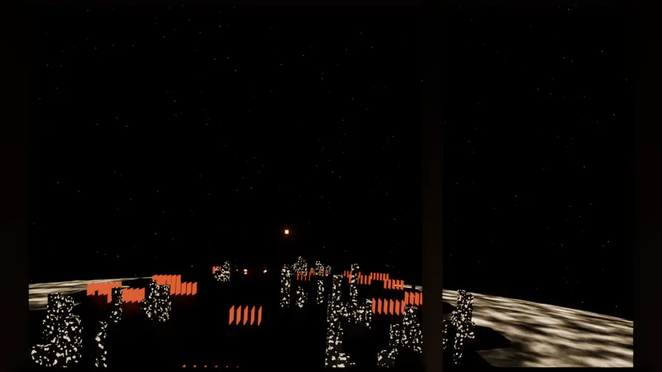
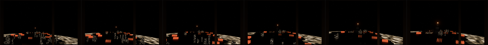
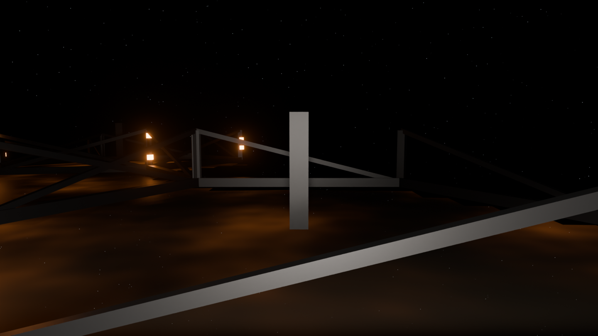
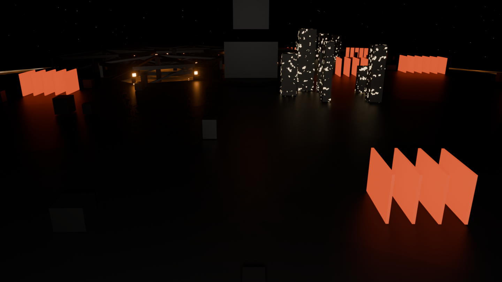
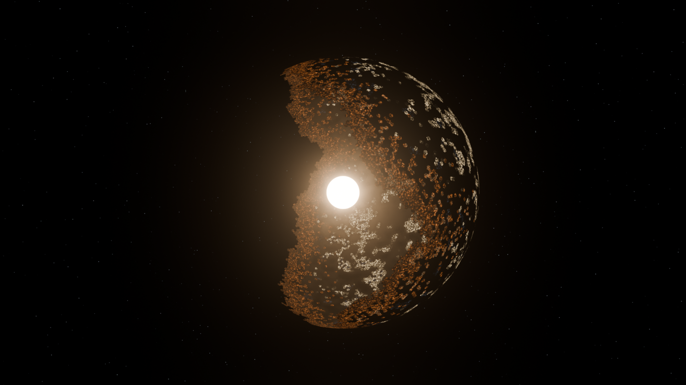
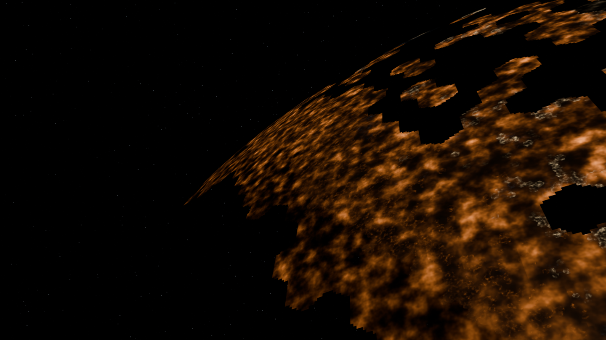
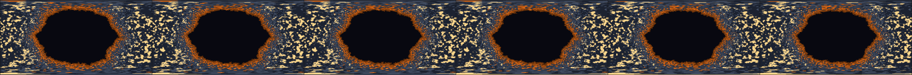
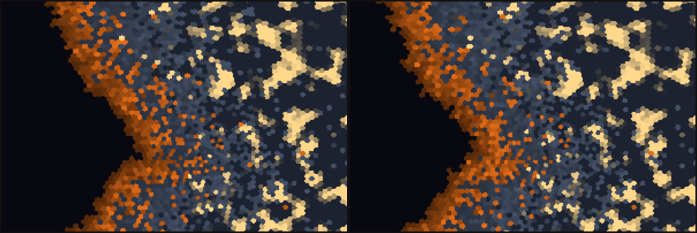

# sunforge

A Dyson shell under construction, watched for two minutes from a freighter
window. A construction CA on a ~40k-cell Goldberg lattice, job-driven drone
swarms, and an event timeline all feed one continuous 120s shot: dark-side
city lights → the live construction front → the blazing gap → a mass-driver
launch → docking. Everything on screen is simulation output.

The full plan (shot table, systems, scale cheat, render budget, milestones)
is in [DESIGN.md](./DESIGN.md).

**Status: M4 done** — the ship flies. `sim/flightpath.py` now emits the full
2880-frame trajectory (`path.npz`): shot legs are *frontier-relative* control
curves (re-seed the shell, restage the film), altitude is clearance-checked
against what's actually built beneath each frame at pass time, banking falls
out of lateral acceleration, micro-shake is seeded noise that gets louder
when low, and the finale parks beside the dock spire at clamp height.
Blender-side: the ship is an empty bulk-keyframed via the 5.x slotted-action
API, with the camera, window mullions, console, instrument glow, and a
forward spot floodlight parented to it; the far-layer statemap steps through
its 120-map sequence with a driver on `frame_offset`. `render_anim.py`
renders any frame range in one process and skips existing frames (resume
proven: a killed run continued exactly where it died).

A 5-second S2 test through the window (city towers, radiator banks, the dock
spire's beacon dead ahead):





**M3** — the near layer. `sim/flightpath.py` extracts the flight
corridor (478 cells under the provisional arc) with *exact* dual-cell
polygons (corners shared between neighbors — seamless tiling), and
`greebles.py` grows real geometry per CA state: skeletal truss frames with
ember work lamps (mostly open below — the deck is a lattice over the glowing
interior), plated slabs with equipment + furnace-hot radiator fin rows,
window-speckled tower blocks on live cells, and foundry spires on the
corridor's two pentagons. Flyover cameras (`--shot s2|s3`) stage at film
altitude against the sim frontiers, dodge the spires, and carry the ship's
own floodlight (the diegetic light source for night flyovers).





**M2** — the far layer lives in Blender. `build_scene.py` builds
the whole-shell sphere whose shader decodes the statemaps (state → alpha +
ember/city/commissioning emission with sub-cell "street" texture), the star
and its light (the interior is lit physically — the terminator and the
aperture blaze are free), a voronoi starfield, bloom via the 5.x group
compositor, and a hero camera staged *against the CA state* (it finds the
construction frontier by walking the equator arc — never eyeballed).





**M1** — the sim runs headless. Goldberg lattice (23042 cells,
12 pentagon foundries), first-passage construction CA staged so a finished
city-lit hemisphere opposes the great unbuilt aperture, equirect statemaps +
previews every 24 frames. `gen_scene.py --seed 7` reproduces everything in
~15s.



The front, close up, at film start vs film end (hex cells popping VOID→TRUSS,
ripening to plate, new city lights igniting):



## Run (target shape — lands with M1+)

```bash
# 1. simulate (uv side): lattice, CA, drones, path, events -> renders/data/
uv run python toys/sunforge/gen_scene.py --seed 7

# 2. build (blender side): data -> renders/shell.blend
tools/blender.sh run toys/sunforge/build_scene.py

# 3. render the film (one blender process, resumable chunks)
tools/blender.sh run toys/sunforge/render_anim.py -- --start 1 --end 2880

# 4. look before you leap (always)
tools/blender.sh snap toys/sunforge/renders/shell.blend toys/sunforge/renders/snap.png
```

Deterministic: one `--seed` drives the lattice, the CA, the boids, the shake,
and the greebles. Same seed, same film.

_Built by fable._
