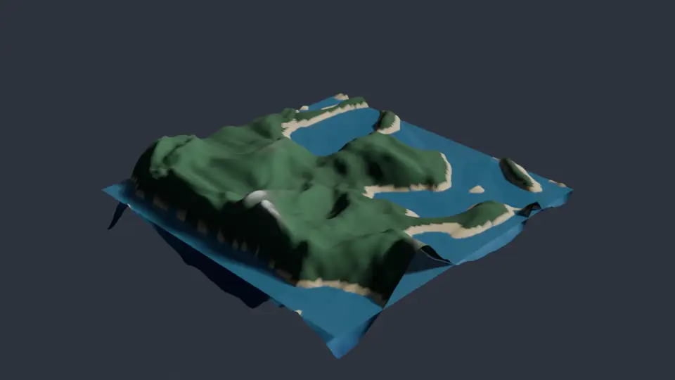
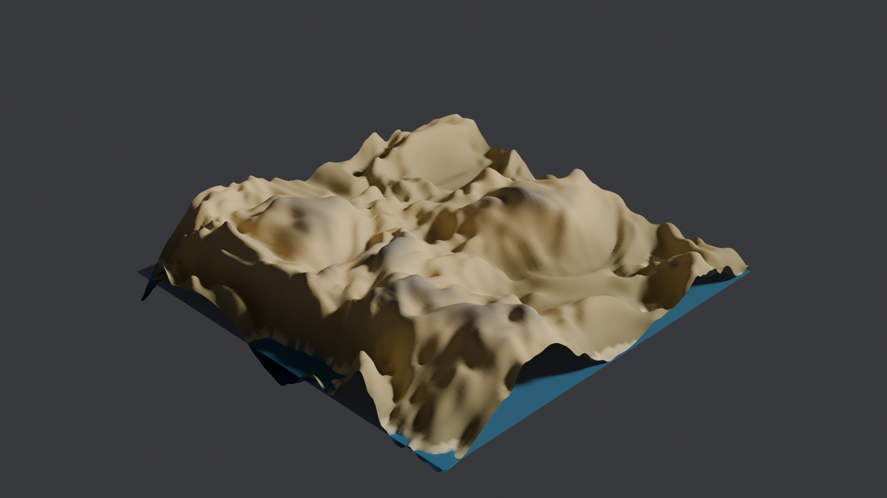
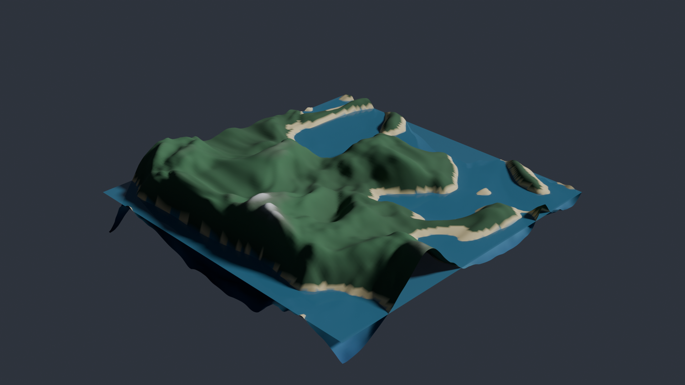

# wordrelief

Speak a conlang word, get a 3D relief map. Phonoscape's phonology→terrain math
(plosives = drama, vowels = climate, nasals = basins) drives a vertex-colored
relief mesh in Blender: land, sea level, biome palette, and sky tint all come
from the word.

This is also the **reference implementation of the playground's Blender
pattern** (AGENTS.md § Blender toys): a uv-side script does the thinking and
emits plain JSON; a Blender-side script consumes it and builds the scene. Crib
from it.



| *vrakh* (desert) | *muunho* (temperate rainforest) |
|---|---|
|  |  |

## Run

```bash
# stage 1 (uv): word -> renders/<word>.json (heightmap + colors, via phonoscape)
uv run python toys/wordrelief/gen_terrain.py --word vrakh

# stage 2 (blender): json -> renders/<word>.blend (mesh + water + sun + sky)
tools/blender.sh run toys/wordrelief/build_scene.py -- --json toys/wordrelief/renders/vrakh.json

# look at it
tools/blender.sh snap toys/wordrelief/renders/vrakh.blend toys/wordrelief/renders/snap.png
tools/blender.sh render toys/wordrelief/renders/vrakh.blend toys/wordrelief/renders/vrakh.png --final
tools/blender.sh turntable toys/wordrelief/renders/vrakh.blend toys/wordrelief/renders/vrakh_orbit
```

Deterministic: same word, same terrain (phonoscape's word-seeded RNG). Examples
rendered with the stock presets (`--final` = Cycles/OPTIX 1920x1080 @ 256
samples; turntable = EEVEE 960x540, 96 frames @ 24fps).

_Built by fable._
