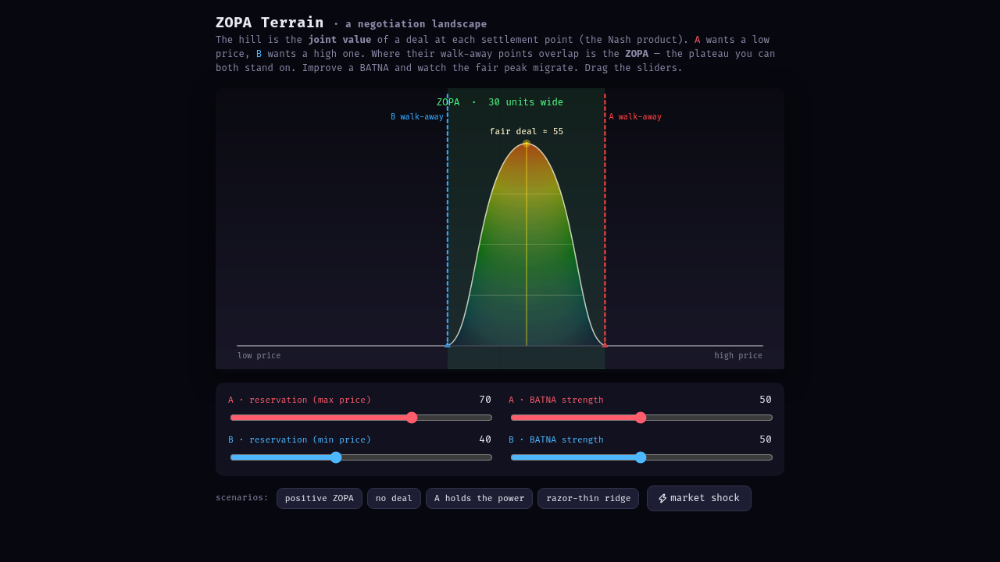
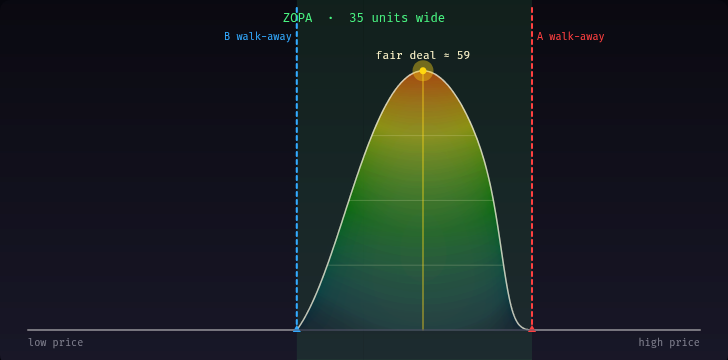
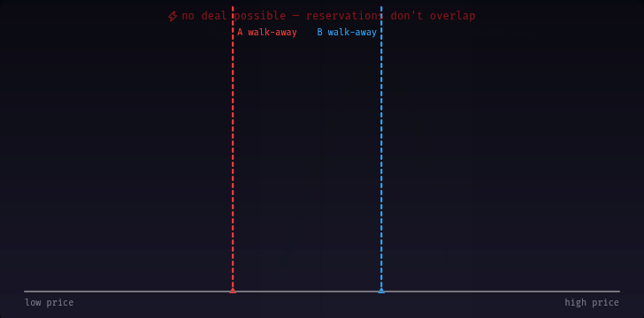

# zopa-terrain

A topographic toy for **negotiation theory**. Drag four sliders and a terrain
morphs in real time to show the **ZOPA** (Zone Of Possible Agreement), each
party's **BATNA cliff**, and the **Nash-product fairness peak**. The terrain
*is* the negotiation — you learn it with your hands.

Single self-contained `index.html`, no build step. p5.js loads from CDN.

_Scaffolded from a `lain` exploration node (`root-1`, seed: "negotiation theory
& practice")._

## Run it

```bash
# just open the file
xdg-open toys/zopa-terrain/index.html

# …or serve it (works everywhere, no deps beyond uv's python)
pnpm --filter zopa-terrain start      # -> http://localhost:8123/index.html
```

## What you're looking at

- **X axis** = the settlement point (deal price, low → high).
- **The hill** = *joint value* of a deal at that point: the **Nash product**
  `surplus_A × surplus_B`. The summit is the fairest deal.
- **A** (red) wants a low price; **B** (blue) wants a high one. Their reservation
  prices are the dashed **walk-away cliffs**.
- **BATNA strength** sharpens each cliff: a strong outside option makes the
  drop-off steep and credible; a weak one is a gentle, bluffable slope.
- The green band between the cliffs is the **ZOPA** — the plateau you can both
  stand on. No overlap → no deal.

### Positive ZOPA — the fair peak sits mid-plateau
A's max (70) is above B's min (40), so a 30-unit ZOPA opens and the fair deal
lands at ~55.



### Asymmetric BATNA — the peak migrates toward the weaker party
A holds a strong BATNA (92), B is weak (18). The fair-deal summit skews from 55
toward 59 — A's outside option lets it capture more of the surplus. A live
argument for *"improve your BATNA before you negotiate."*



### No deal — reservations don't overlap
Drag A's max below B's min and the hill collapses into a void; the cliffs face
each other across nothing and the warning pulses.



## Things to try

- The **scenario buttons** (positive / no deal / A holds the power / razor-thin
  ridge) snap to instructive states.
- **⚡ market shock** randomly perturbs one party's BATNA, simulating external
  news mid-negotiation — watch the peak jump.
- Pull both reservations until they barely overlap (the *razor-thin ridge*) to
  feel how fragile marginal deals are.

## The math

```
surplus_A(x) = max(0, A_reservation − x) · sigmoid(A_reservation − x, k·A_BATNA)
surplus_B(x) = max(0, x − B_reservation) · sigmoid(x − B_reservation, k·B_BATNA)
value(x)     = surplus_A(x) · surplus_B(x)     # Nash product
```

The sigmoid is the "cliff": BATNA strength scales its sharpness, so a strong
BATNA defends the reservation price firmly and a weak one caves near the edge.
